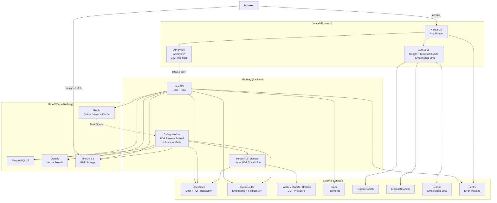
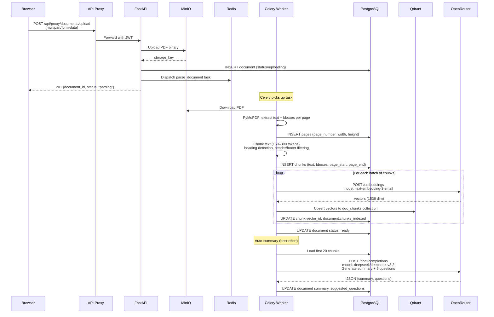
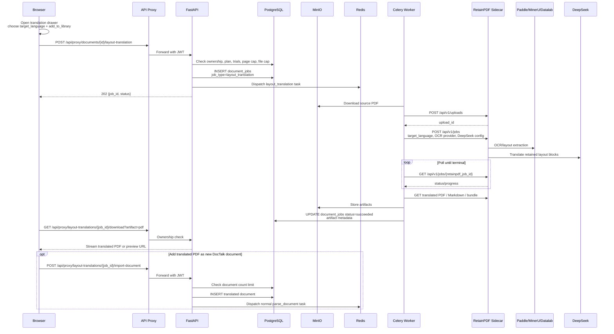
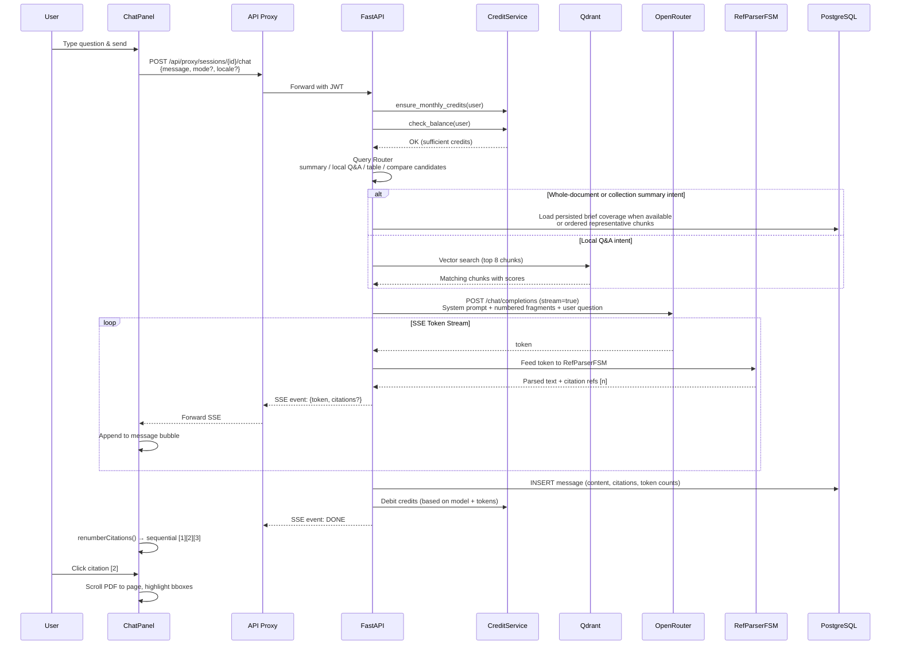
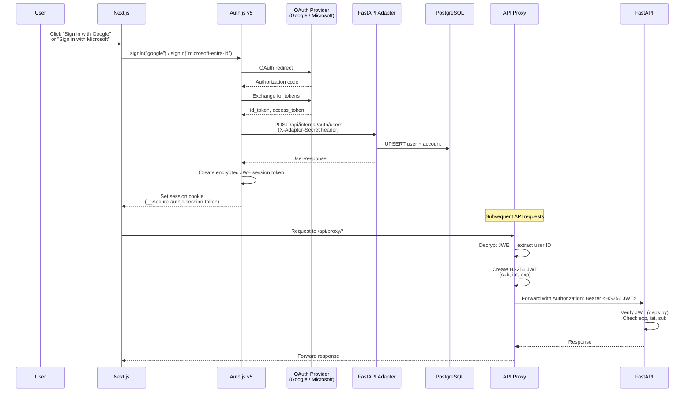
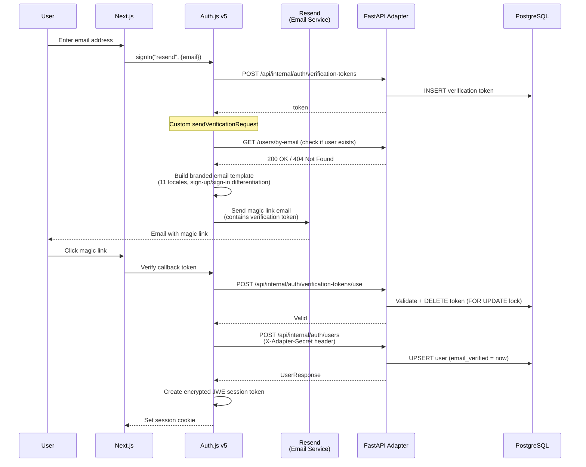
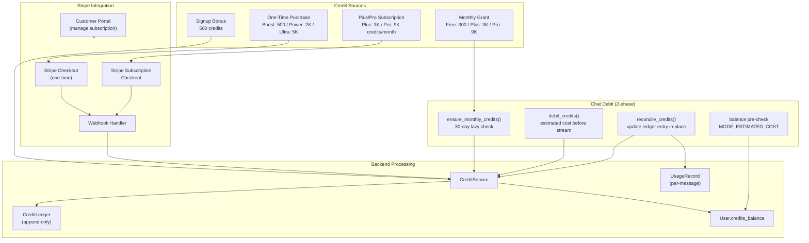
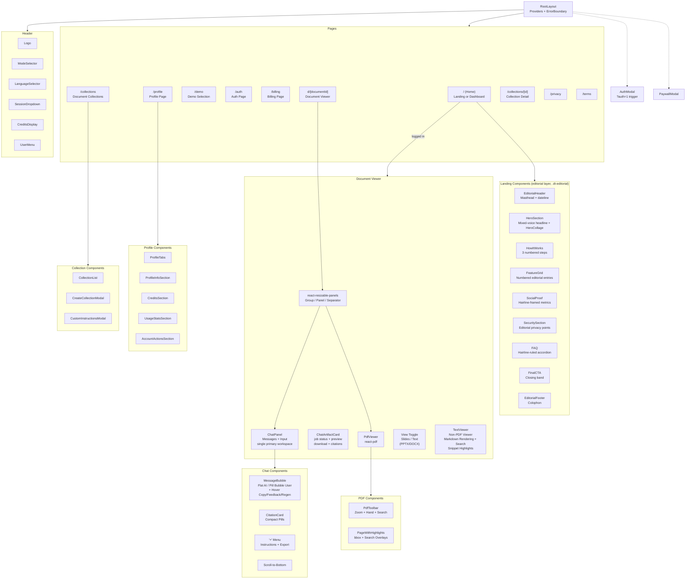
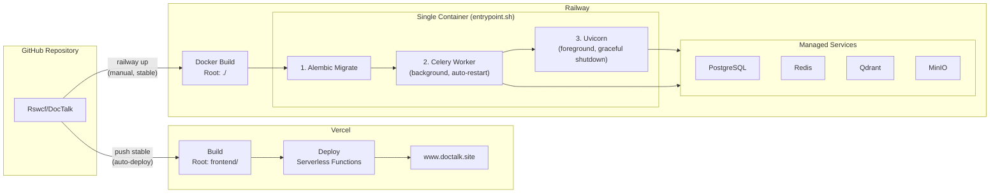

# DocTalk Architecture

[中文版](ARCHITECTURE.zh.md)

This document provides a deep-dive into DocTalk's architecture with Mermaid diagrams covering system topology, data flows, authentication, billing, database schema, and frontend component structure.

---

## 1. System Overview


```mermaid
graph TB
    Browser["Browser"]

    subgraph Vercel["Vercel (Frontend)"]
        NextJS["Next.js 14<br/>App Router"]
        AuthJS["Auth.js v5<br/>Google + Microsoft OAuth<br/>+ Email Magic Link"]
        Proxy["API Proxy<br/>/api/proxy/*<br/>JWT Injection"]
    end

    subgraph Railway["Railway (Backend)"]
        FastAPI["FastAPI<br/>REST + SSE"]
        Celery["Celery Worker<br/>PDF Parse + Embed<br/>+ Async Artifacts"]
        RetainPDF["RetainPDF Sidecar<br/>Layout PDF Translation"]
    end

    subgraph DataStores["Data Stores (Railway)"]
        PG["PostgreSQL 16"]
        Qdrant["Qdrant<br/>Vector Search"]
        Redis["Redis<br/>Celery Broker + Cache"]
        MinIO["MinIO / S3<br/>PDF Storage"]
    end

    subgraph External["External Services"]
        DeepSeek["DeepSeek<br/>Chat + PDF Translation"]
        OpenRouter["OpenRouter<br/>Embedding + Fallback API"]
        OCRProviders["Paddle / MinerU / Datalab<br/>OCR Providers"]
        Stripe["Stripe<br/>Payments"]
        Google["Google OAuth"]
        Microsoft["Microsoft OAuth"]
        Resend["Resend<br/>Email Magic Link"]
        Sentry["Sentry<br/>Error Tracking"]
    end

    Browser -->|HTTPS| NextJS
    NextJS --> AuthJS
    NextJS --> Proxy
    Proxy -->|HS256 JWT| FastAPI
    FastAPI --> PG
    FastAPI --> Qdrant
    FastAPI --> Redis
    FastAPI --> MinIO
    FastAPI --> DeepSeek
    FastAPI --> OpenRouter
    FastAPI --> Stripe
    Celery --> PG
    Celery --> Qdrant
    Celery --> MinIO
    Celery --> RetainPDF
    Celery --> DeepSeek
    Celery --> OpenRouter
    RetainPDF --> OCRProviders
    RetainPDF --> DeepSeek
    Redis -.->|Task Queue| Celery
    AuthJS --> Google
    AuthJS --> Microsoft
    AuthJS --> Resend
    FastAPI --> Sentry
    NextJS --> Sentry
    Browser -->|Presigned URL| MinIO
```

**Component roles:**

| Component | Role |
|-----------|------|
| **Next.js** | Client-side rendered SPA (`"use client"`), handles routing, i18n, and UI state (Zustand) |
| **Auth.js v5** | Authentication via 3 providers: Google OAuth, Microsoft OAuth, and Email Magic Link (via Resend). Encrypted JWE session tokens |
| **API Proxy** | Translates JWE tokens to HS256 JWT, injects `Authorization` header for all backend requests |
| **FastAPI** | REST API + SSE streaming for chat, document management, billing, user accounts, and layout-translation job creation |
| **Celery** | Async document parsing and artifact work: text extraction (PDF/DOCX/PPTX/XLSX/TXT/MD/URL) → chunking → embedding → vector indexing; layout-translation polling and artifact persistence. PPTX/DOCX files are also converted to PDF via LibreOffice headless for visual rendering |
| **RetainPDF sidecar** | Railway service used only for layout-preserving PDF translation: OCR orchestration, translation batching, translated PDF rendering |
| **PostgreSQL** | Primary data store for users, documents, pages, chunks, sessions, messages, credits |
| **Qdrant** | Vector database for semantic search (COSINE similarity, 1536 dimensions) |
| **Redis** | Celery task broker and result backend |
| **MinIO** | S3-compatible object storage for uploaded files with SSE-S3 encryption at rest |
| **DeepSeek** | Primary chat and PDF translation model provider |
| **OpenRouter** | Embedding and fallback model gateway |
| **OCR providers** | Paddle, MinerU, or Datalab credentials used by RetainPDF during layout translation |
| **Stripe** | Payment processing for credit purchases and Plus/Pro subscriptions (monthly + annual) |
| **Sentry** | Error tracking and performance monitoring for both backend (FastAPI + Celery) and frontend (Next.js) |

---

## 2. PDF Upload & Parse Pipeline


```mermaid
sequenceDiagram
    participant B as Browser
    participant P as API Proxy
    participant API as FastAPI
    participant S3 as MinIO
    participant R as Redis
    participant W as Celery Worker
    participant DB as PostgreSQL
    participant Q as Qdrant
    participant OR as OpenRouter

    B->>P: POST /api/proxy/documents/upload<br/>(multipart/form-data)
    P->>API: Forward with JWT
    API->>S3: Upload PDF binary
    S3-->>API: storage_key
    API->>DB: INSERT document (status=uploading)
    API->>R: Dispatch parse_document task
    API-->>B: 201 {document_id, status: "parsing"}

    Note over W: Celery picks up task
    W->>S3: Download PDF
    W->>W: PyMuPDF: extract text + bboxes per page
    W->>DB: INSERT pages (page_number, width, height)
    W->>W: Chunk text (150–300 tokens)<br/>heading detection, header/footer filtering
    W->>DB: INSERT chunks (text, bboxes, page_start, page_end)

    loop For each batch of chunks
        W->>OR: POST /embeddings<br/>model: text-embedding-3-small
        OR-->>W: vectors (1536 dim)
        W->>Q: Upsert vectors to doc_chunks collection
        W->>DB: UPDATE chunk.vector_id, document.chunks_indexed
    end

    W->>DB: UPDATE document status=ready

    Note over W: Auto-summary (best-effort)
    W->>DB: Load first 20 chunks
    W->>OR: POST /chat/completions<br/>model: deepseek/deepseek-v3.2<br/>Generate summary + 5 questions
    OR-->>W: JSON {summary, questions}
    W->>DB: UPDATE document summary, suggested_questions
```

**Step-by-step:**

1. **Upload**: Browser sends PDF via multipart form through the API proxy. Backend validates per-plan document count and file size limits, performs magic-byte file validation (PDF `%PDF` header, Office ZIP structure + `[Content_Types].xml`, 500MB zip bomb protection), sanitizes the filename (Unicode normalization, control char stripping, double-extension blocking), stores the file in MinIO with SSE-S3 encryption, and creates a document record.

2. **Text Extraction**: Celery worker downloads the PDF and uses **PyMuPDF (fitz)** to extract text with bounding-box coordinates per page. Coordinates are normalized to `[0, 1]` range (top-left origin).

2a. **OCR fallback** (PDFs only; status → `ocr`): OCR runs when the PDF is **scanned** (`detect_scanned` — no text layer) **or low-quality** (`detect_low_quality_text` — a text layer exists but is garbled, e.g. a broken-font cmap that extracts as mojibake; scored with a Unicode-aware letter/number ratio, two-tier so good CJK is never false-flagged). The OCR **language is content-based**: `detect_script_osd` runs Tesseract OSD (`--psm 0`) on sample pages to detect the script, then `resolve_ocr_languages(locale, script)` selects a **narrow** Tesseract set (the script family, ≤3 languages, no `eng` appended to non-Latin scripts — extra languages make Tesseract hallucinate cross-script glyphs and run far slower). The UI `locale` only disambiguates within a script family. A low-quality re-OCR is adopted only if it improves on the existing text-layer quality. The worker records `parse_version`, `parse_method` (`text`/`ocr`), `text_quality`, and `ocr_languages` on the document (used by `scripts/find_low_quality_docs.py` to backfill docs parsed before a fix).

3. **Chunking**: Text is split into 150–300 token windows with:
   - Heading detection for section titles
   - Header/footer filtering to remove repeated page elements
   - Simple two-column reading-order detection so body text is chunked by
     column instead of interleaving left/right rows
   - Language-aware block joining that preserves English word boundaries while
     avoiding unnecessary spaces before punctuation or between adjacent CJK
     characters
   - Each chunk stores `page_start`, `page_end`, and `bboxes` (JSONB array of normalized rectangles)

4. **Embedding**: Chunks are sent to OpenRouter's `openai/text-embedding-3-small` endpoint in batches, producing 1536-dimensional vectors.

5. **Vector Indexing**: Vectors are upserted into Qdrant's `doc_chunks` collection with COSINE similarity metric. The collection dimension is configuration-driven (`EMBEDDING_DIM`).

6. **Completion**: Document status transitions from `parsing` → `ready`. The frontend polls status and transitions to the document viewer.

7. **Auto-Summary** (best-effort): After status becomes `ready`, the worker loads the first 20 chunks and calls a budget LLM (DeepSeek) to generate a 2–3 paragraph summary and 5 suggested questions. Results are stored in the `summary` and `suggested_questions` columns. Failures are logged but do not affect document status.

**Idempotent re-parse**: re-running the parse (manual reprocess, stuck-doc retry, or backfill) first **deletes the document's Qdrant vectors (by `document_id` filter) BEFORE deleting its DB pages/chunks**. This ordering is load-bearing: if the Qdrant delete fails, the worker sets a structured error and returns with the existing rows intact, so the vector store and relational store never diverge and a transient outage can't silently drop a previously-good parse.

### Layout-Preserving PDF Translation Flow

Layout translation is a user-triggered artifact workflow for PDFs that already
exist in DocTalk. It is intentionally parallel to normal chat: users can ignore
it, keep chatting with the source PDF, or create a translated PDF when needed.


```mermaid
sequenceDiagram
    participant B as Browser
    participant P as API Proxy
    participant API as FastAPI
    participant DB as PostgreSQL
    participant S3 as MinIO
    participant R as Redis
    participant W as Celery Worker
    participant RP as RetainPDF Sidecar
    participant OCR as Paddle/MinerU/Datalab
    participant DS as DeepSeek

    B->>B: Open translation drawer<br/>choose target_language + add_to_library
    B->>P: POST /api/proxy/documents/{id}/layout-translation
    P->>API: Forward with JWT
    API->>DB: Check ownership, plan, trials, page cap, file cap
    API->>DB: INSERT document_jobs<br/>job_type=layout_translation
    API->>R: Dispatch layout_translation task
    API-->>B: 202 {job_id, status}

    W->>S3: Download source PDF
    W->>RP: POST /api/v1/uploads
    RP-->>W: upload_id
    W->>RP: POST /api/v1/jobs<br/>target_language, OCR provider, DeepSeek config
    RP->>OCR: OCR/layout extraction
    RP->>DS: Translate retained layout blocks

    loop Poll until terminal
        W->>RP: GET /api/v1/jobs/{retainpdf_job_id}
        RP-->>W: status/progress
    end

    W->>RP: GET translated PDF / Markdown / bundle
    W->>S3: Store artifacts
    W->>DB: UPDATE document_jobs status=succeeded<br/>artifact metadata

    B->>P: GET /api/proxy/layout-translations/{job_id}/download?artifact=pdf
    P->>API: Ownership check
    API-->>B: Stream translated PDF or preview URL

    opt Add translated PDF as new DocTalk document
        B->>P: POST /api/proxy/layout-translations/{job_id}/import-document
        P->>API: Forward with JWT
        API->>DB: Check document count limit
        API->>DB: INSERT translated document
        API->>R: Dispatch normal parse_document task
    end
```

User-facing endpoints:

- `POST /api/documents/{document_id}/layout-translation` with
  `target_language`, `locale`, and `add_to_library`.
- `GET /api/layout-translations/{job_id}/download?artifact=pdf|markdown|bundle`.
- `POST /api/layout-translations/{job_id}/import-document`.

Supported targets are Chinese (`zh-CN`), English (`en`), Japanese (`ja`),
Korean (`ko`), Spanish (`es`), German (`de`), French (`fr`), Portuguese (`pt`),
Italian (`it`), Arabic (`ar`), and Hindi (`hi`).

Cost controls run before RetainPDF receives the file: free users get 2 lifetime
successful or active trials and a 25-page PDF cap; Plus is capped at 150 pages;
Pro is capped at 300 pages; every plan has a 50 MB layout-translation file cap.
Optional import as a new DocTalk document also respects the user's document
count limit.

Quality scope is deliberately narrower than generic "all PDF translation":
text-heavy papers, contracts, manuals, filings, reports, and articles are the
best fit. Table-heavy bills, invoices, forms, dense financial statements,
handwritten scans, stamps, and unusual embedded fonts still require human
review after preview.

---

## 3. Chat & Citation Flow


```mermaid
sequenceDiagram
    participant U as User
    participant CP as ChatPanel
    participant P as API Proxy
    participant API as FastAPI
    participant CS as CreditService
    participant Q as Qdrant
    participant OR as OpenRouter
    participant FSM as RefParserFSM
    participant DB as PostgreSQL

    U->>CP: Type question & send
    CP->>P: POST /api/proxy/sessions/{id}/chat<br/>{message, mode?, locale?}
    P->>API: Forward with JWT

    API->>CS: ensure_monthly_credits(user)
    API->>CS: check_balance(user)
    CS-->>API: OK (sufficient credits)

    API->>API: Query Router<br/>summary / local Q&A / table / compare candidates
    alt Whole-document or collection summary intent
        API->>DB: Load persisted brief coverage when available<br/>or ordered representative chunks
    else Local Q&A intent
        API->>Q: Vector search (top 8 chunks)
        Q-->>API: Matching chunks with scores
    end

    API->>OR: POST /chat/completions (stream=true)<br/>System prompt + numbered fragments + user question

    loop SSE Token Stream
        OR-->>API: token
        API->>FSM: Feed token to RefParserFSM
        FSM-->>API: Parsed text + citation refs [n]
        API-->>P: SSE event: {token, citations?}
        P-->>CP: Forward SSE
        CP->>CP: Append to message bubble
    end

    API->>DB: INSERT message (content, citations, token counts)
    API->>CS: Debit credits (based on model + tokens)
    API-->>P: SSE event: DONE
    CP->>CP: renumberCitations() → sequential [1][2][3]
    U->>CP: Click citation [2]
    CP->>CP: Scroll PDF to page, highlight bboxes
```

**Key components:**

- **Query Router**: Chat requests first pass through a deterministic,
  multi-label-ready router that classifies summary, local Q&A, table, compare,
  citation lookup, existence-check, and exhaustive-scan candidates. Whole-document
  and collection summary requests are routed away from ordinary semantic top-k
  retrieval.

- **Query Planner**: Comparison, multi-hop, exhaustive, and multi-entity metric
  routes are passed through a deterministic planner before corrective retrieval.
  The planner creates bounded evidence steps such as entity-metric coverage and
  per-document comparison coverage, then labels retrieved fragments with
  controlled step names. Raw planned queries are not echoed into the system
  prompt.

- **Retrieval**: Chunk RAG remains the citation anchor and ordinary local-Q&A
  path. As of `0.17.0 beta`, parsing and table scans also write canonical
  `document_elements` for headings, paragraphs, and tables. Whole-document
  summaries, structured extraction, semantic diff, and table/numeric workflows
  first select broad element-aware coverage, then fall back to vector/lexical
  chunks when needed. Whole-document summaries still prefer persisted
  `document_briefs.coverage` when available, and collection summaries use capped
  per-document representative coverage, so vague prompts like "summarize this
  document" do not over-select tables, appendices, or sidebars. Ordinary local
  Q&A, citation lookup, existence checks, and exhaustive scans first run Qdrant
  COSINE vector search, then pass through a retrieval evaluator. If the evidence
  is empty, weak, missing exact query terms, or under-covered for an exhaustive
  route, DocTalk runs scoped lexical fallback over chunk text and section titles,
  de-duplicates the result set, and injects an evidence-quality note into the
  LLM prompt. Each fragment includes text, page numbers, and bounding boxes.
  Table/numeric routes additionally consult scanned `document_tables` when
  available, format matching rows as structured evidence, and lower the lexical
  chunk-length threshold so short parsed table rows are not filtered out.
  Collection comparison routes add balanced per-document evidence so one strong
  hit cannot crowd out the other documents being compared.

- **Document Brief**: After parsing marks a document ready, `brief_worker`
  generates a persisted hierarchical brief in `document_briefs` on the Celery
  `default` queue. The brief stores summary, outline, key points, facts,
  suggested questions, generation errors, and representative chunk coverage.
  The legacy `documents.summary` and `documents.suggested_questions` fields are
  mirrored from this payload for compatibility. Brief remains an internal
  capability used by summary routing and APIs; the primary reader UI no longer
  exposes a separate Brief workspace.

- **Chat-Native Tools**: Starting in `0.15.0 beta`, chat requests first pass
  through `ActionPlanner`. Ordinary Q&A, summaries, and citation lookups stay on
  the RAG path. Tool-like requests such as "extract all tables as CSV",
  "generate an executive summary", "create a checklist", or "compare with the
  old version" route to `ChatToolExecutor`, which creates or reuses existing
  `document_jobs` while preserving ownership checks, plan gating, quotas, and
  credits. The assistant message persists an `artifacts` array in
  `messages.metadata_json`; clients receive optional `tool_status` and
  `artifact` SSE events and poll `GET /api/document-jobs/{job_id}` for updates.

- **Summary Context**: If no persisted brief coverage exists yet, the RAG
  workbench path first uses `document_elements` to cover headings, representative
  paragraphs, table locations, evenly spaced body positions, and the tail of the
  document. If no elements exist for legacy documents, it falls back to
  representative chunks while skipping tiny chunks that are usually footers or
  sidebars.

- **LLM Prompt**: System prompt instructs the model to cite sources using `[n]` notation matching the numbered document fragments provided. Production chat modes use DeepSeek V4 (`quick` = Flash, `balanced` = Pro); anonymous demo users are forced to `DEMO_LLM_MODEL` (default DeepSeek V4 Flash) to control cost. A **model-adaptive prompt system** (`model_profiles.py`) tailors the rules section and API parameters per model: DeepSeek uses `positive_framing` to avoid negative-framing over-compliance, other models use the `default` style. Temperature, max_tokens, and feature flags (stream_options) are also per-model.

- **RefParserFSM**: A finite state machine in `chat_service.py` that handles `[n]` citation markers split across streaming token boundaries. For example, token `"[1"` followed by `"]"` is correctly parsed as citation reference 1.

- **Claim Verification**: After generation, `claim_verifier_service.py`
  evaluates the final assistant text and citation payload before the `done`
  SSE event. It counts claim-like answer units, checks missing citations,
  rejects citation refs that do not map to retrieved evidence, and flags
  citations whose source text/table context has low overlap with the cited
  claim after stopword filtering. Numeric claims additionally require the cited
  context to contain the same numeric tokens, so a table row with a different
  revenue/date/percentage is reported as a mismatch even when the entity name
  overlaps. The result is returned in the `done` payload and stored as an
  internal `rag_verification_completed` `ProductEvent`; the admin
  `/api/admin/rag-quality` endpoint aggregates these events for quality
  monitoring without exposing bbox/chunk internals through public analytics.

- **Frontend Rendering**: `renumberCitations()` in ChatPanel reassigns citation numbers to a sequential series `[1], [2], [3]...` based on order of appearance, regardless of the backend's original numbering.

- **PDF Highlight**: When a user clicks a citation, the PDF viewer scrolls to the referenced page and renders translucent overlay rectangles using the chunk's normalized bbox coordinates multiplied by the page's pixel dimensions.

---

## 4. Authentication Flow

DocTalk supports 3 authentication providers: **Google OAuth**, **Microsoft OAuth**, and **Email Magic Link** (via Resend). All three follow the same Auth.js v5 flow with provider-specific differences in the initial handshake.

### 4a. OAuth Flow (Google / Microsoft)


```mermaid
sequenceDiagram
    participant U as User
    participant NJ as Next.js
    participant AJ as Auth.js v5
    participant OP as OAuth Provider<br/>(Google / Microsoft)
    participant AD as FastAPI Adapter
    participant DB as PostgreSQL
    participant PX as API Proxy
    participant API as FastAPI

    U->>NJ: Click "Sign in with Google"<br/>or "Sign in with Microsoft"
    NJ->>AJ: signIn("google") / signIn("microsoft-entra-id")
    AJ->>OP: OAuth redirect
    OP-->>AJ: Authorization code
    AJ->>OP: Exchange for tokens
    OP-->>AJ: id_token, access_token

    AJ->>AD: POST /api/internal/auth/users<br/>(X-Adapter-Secret header)
    AD->>DB: UPSERT user + account
    AD-->>AJ: UserResponse

    AJ->>AJ: Create encrypted JWE session token
    AJ-->>NJ: Set session cookie<br/>(__Secure-authjs.session-token)

    Note over PX: Subsequent API requests
    NJ->>PX: Request to /api/proxy/*
    PX->>PX: Decrypt JWE → extract user ID
    PX->>PX: Create HS256 JWT<br/>(sub, iat, exp)
    PX->>API: Forward with Authorization: Bearer <HS256 JWT>
    API->>API: Verify JWT (deps.py)<br/>Check exp, iat, sub
    API-->>PX: Response
    PX-->>NJ: Forward response
```

### 4b. Email Magic Link Flow


```mermaid
sequenceDiagram
    participant U as User
    participant NJ as Next.js
    participant AJ as Auth.js v5
    participant RS as Resend<br/>(Email Service)
    participant AD as FastAPI Adapter
    participant DB as PostgreSQL

    U->>NJ: Enter email address
    NJ->>AJ: signIn("resend", {email})
    AJ->>AD: POST /api/internal/auth/verification-tokens
    AD->>DB: INSERT verification token
    AD-->>AJ: token

    Note over AJ: Custom sendVerificationRequest
    AJ->>AD: GET /users/by-email (check if user exists)
    AD-->>AJ: 200 OK / 404 Not Found
    AJ->>AJ: Build branded email template<br/>(11 locales, sign-up/sign-in differentiation)
    AJ->>RS: Send magic link email<br/>(contains verification token)
    RS-->>U: Email with magic link

    U->>NJ: Click magic link
    NJ->>AJ: Verify callback token
    AJ->>AD: POST /api/internal/auth/verification-tokens/use
    AD->>DB: Validate + DELETE token (FOR UPDATE lock)
    AD-->>AJ: Valid

    AJ->>AD: POST /api/internal/auth/users<br/>(X-Adapter-Secret header)
    AD->>DB: UPSERT user (email_verified = now)
    AD-->>AJ: UserResponse

    AJ->>AJ: Create encrypted JWE session token
    AJ-->>NJ: Set session cookie
```

### Why dual JWT?

Auth.js v5 encrypts session tokens as JWE (JSON Web Encryption), which the Python backend cannot decrypt without sharing the encryption key and matching the exact encryption algorithm. Instead of coupling the two systems:

1. The **API proxy** (`/api/proxy/[...path]/route.ts`) decrypts the JWE using Auth.js's built-in `getToken()` function
2. It creates a new **HS256-signed JWT** with just `sub` (user ID), `iat`, and `exp` claims
3. The backend validates this simple JWT using the shared `AUTH_SECRET`

This cleanly separates the frontend auth system from the backend API authentication.

### Auth providers summary

| Provider | Auth.js Provider ID | Details |
|----------|-------------------|---------|
| **Google** | `google` | OAuth 2.0 via Google Cloud Console |
| **Microsoft** | `microsoft-entra-id` | OAuth 2.0 via Microsoft Entra ID (Azure AD) |
| **Email** | `resend` | Passwordless magic link via Resend email service |

**Internal Auth Adapter**: Auth.js uses a custom adapter that calls the FastAPI backend's `/api/internal/auth/*` endpoints (protected by `X-Adapter-Secret` header) to manage users, accounts, and verification tokens in PostgreSQL.

**Email Magic Link System**: The Resend provider uses a custom `sendVerificationRequest` function (`frontend/src/lib/auth.ts`) that provides:
- **Branded email templates** (`buildSignInEmail` from `emailTemplate.ts`) with DocTalk logo, styling, and branding
- **11-locale i18n support** — subject and body text translated based on user's `NEXT_LOCALE` cookie
- **Sign-up vs. sign-in differentiation** — checks if the user exists via backend API, then adjusts the email copy ("Welcome to DocTalk" vs. "Sign in to DocTalk")
- **Reply-To header** pointing to `support@doctalk.site` for user inquiries

**Expired token cleanup**: A Celery Beat periodic task (`cleanup_expired_verification_tokens`) runs daily to delete verification tokens that expired more than 48 hours ago, keeping the database clean.

---

## 5. Billing & Credits Flow


```mermaid
flowchart TB
    subgraph Sources["Credit Sources"]
        Signup["Signup Bonus<br/>500 credits"]
        Monthly["Monthly Grant<br/>Free: 300 / Plus: 3K / Pro: 9K"]
        Purchase["One-Time Purchase<br/>Boost: 500 / Power: 2K / Ultra: 5K"]
        Subscription["Plus/Pro Subscription<br/>Plus: 3K / Pro: 9K credits/month"]
    end

    subgraph Stripe["Stripe Integration"]
        Checkout["Stripe Checkout<br/>(one-time)"]
        SubCheckout["Stripe Subscription<br/>Checkout"]
        Portal["Customer Portal<br/>(manage subscription)"]
        Webhook["Webhook Handler"]
    end

    subgraph Backend["Backend Processing"]
        CreditService["CreditService"]
        Ledger["CreditLedger<br/>(append-only)"]
        Balance["User.credits_balance"]
        UsageRecord["UsageRecord<br/>(per-message)"]
    end

    subgraph Chat["Chat Debit (2-phase)"]
        EnsureMonthly["ensure_monthly_credits()<br/>30-day lazy check"]
        PreCheck["balance pre-check<br/>MODE_ESTIMATED_COST"]
        PreDebit["debit_credits()<br/>estimated cost before stream"]
        Reconcile["reconcile_credits()<br/>update ledger entry in-place"]
    end

    Signup --> CreditService
    Monthly --> EnsureMonthly
    Purchase --> Checkout --> Webhook --> CreditService
    Subscription --> SubCheckout --> Webhook
    Portal --> Stripe

    CreditService --> Ledger
    CreditService --> Balance

    EnsureMonthly --> CreditService
    PreCheck --> Balance
    PreDebit --> CreditService
    Reconcile --> CreditService
    Reconcile --> UsageRecord
```

**Credit lifecycle:**

1. **Signup Bonus**: New users receive 500 credits on first login (configurable via `SIGNUP_BONUS_CREDITS`; idempotent, `signup_bonus_granted_at` timestamp guards against double-grant).

2. **Monthly Grant**: `ensure_monthly_credits()` is called before every chat request. It checks `monthly_credits_granted_at` — if 30+ days have elapsed, grants Free (300), Plus (3K), or Pro (9K) credits based on the user's plan. The ledger entry uses `ref_type=monthly_grant` with a timestamp-based `ref_id` for idempotency.

3. **One-Time Purchase**: Stripe Checkout creates a payment session. On `checkout.session.completed` webhook (mode=payment), credits are added to the user's balance. Idempotent by `payment_intent` ID.

4. **Plus/Pro Subscription**: Stripe recurring subscription (monthly or annual). `checkout.session.completed` (mode=subscription) only updates the user's plan — it does **not** grant credits (prevents double-grant with invoice webhook). Credits are granted solely via `invoice.payment_succeeded` webhook based on plan (Plus: 3K, Pro: 9K). Idempotent by `invoice.id`. On `customer.subscription.deleted`, plan is reset to Free.

5. **Chat Debit (2-phase)**: ① `chat.py` pre-checks balance >= `MODE_ESTIMATED_COST` (quick=5, balanced=15, thorough=35), returns 402 if insufficient. ② `chat_service.py` calls `debit_credits()` to debit estimated cost before LLM streaming starts (returns ledger entry ID). After streaming completes, `reconcile_credits()` updates the **same ledger entry in-place** (delta and balance_after) to reflect actual token-based cost — no new entries are created. Each chat produces exactly one ledger row (reason="chat"). On LLM failure, the ledger entry is deleted and credits fully refunded (no trace). All operations recorded in `CreditLedger` (balance tracking) and `UsageRecord` (analytics).

---

## 6. Database Schema

```mermaid
erDiagram
    User ||--o{ Document : "uploads"
    User ||--o{ Account : "has"
    User ||--o{ CreditLedger : "has"
    User ||--o{ UsageRecord : "has"
    User ||--o{ Collection : "owns"
    User ||--o{ DocumentJob : "runs"
    Collection }o--o{ Document : "contains"
    Collection ||--o{ ChatSession : "has"
    Collection ||--o{ DocumentJob : "scopes"
    Document ||--o{ Page : "contains"
    Document ||--o{ Chunk : "contains"
    Document ||--o{ ChatSession : "has"
    Document ||--o{ DocumentJob : "scopes"
    Document ||--o{ DocumentTable : "has"
    ChatSession ||--o{ Message : "contains"
    Message ||--o| UsageRecord : "tracks"
    DocumentJob ||--o| ExtractionResult : "stores"

    User {
        uuid id PK
        string email UK
        string name
        string image
        datetime email_verified
        int credits_balance
        datetime signup_bonus_granted_at
        string plan "free | plus | pro"
        string stripe_customer_id
        string stripe_subscription_id
        datetime monthly_credits_granted_at
        datetime created_at
        datetime updated_at
    }

    Document {
        uuid id PK
        string filename
        int file_size
        int page_count
        string storage_key
        string status "uploading | parsing | ocr | ready | error | deleting"
        string error_msg
        int pages_parsed
        int chunks_total
        int chunks_indexed
        int parse_version "nullable (R2b backfill marker)"
        string parse_method "nullable (text | ocr)"
        float text_quality "nullable (Unicode letter/number ratio)"
        string ocr_languages "nullable (resolved Tesseract set)"
        uuid user_id FK "nullable (demo docs)"
        string demo_slug UK "nullable"
        text summary "AI-generated summary"
        jsonb suggested_questions "AI-generated questions"
        text custom_instructions "User AI instructions"
        string file_type "pdf | docx | pptx | xlsx | txt | md"
        string converted_storage_key "converted PDF for PPTX/DOCX"
        string source_url "URL for imported webpages"
        datetime created_at
        datetime updated_at
    }

    Page {
        uuid id PK
        uuid document_id FK
        int page_number
        float width_pt "nullable (non-PDF)"
        float height_pt "nullable (non-PDF)"
        text content "original extracted text"
        int rotation
    }

    Chunk {
        uuid id PK
        uuid document_id FK
        int chunk_index
        text text
        int token_count
        int page_start
        int page_end
        jsonb bboxes "normalized [0,1] coordinates"
        string section_title
        string vector_id
        datetime created_at
    }

    ChatSession {
        uuid id PK
        uuid document_id FK "nullable"
        uuid collection_id FK "nullable"
        string title
        datetime created_at
        datetime updated_at
    }

    Message {
        uuid id PK
        uuid session_id FK
        string role "user | assistant"
        text content
        jsonb citations
        jsonb metadata_json "chat artifacts + action metadata"
        int prompt_tokens
        int output_tokens
        datetime created_at
    }

    Account {
        uuid id PK
        uuid user_id FK
        string type
        string provider
        string provider_account_id
        string refresh_token "stripped on save"
        string access_token "stripped on save"
        int expires_at
        string token_type
        string scope
        string id_token "stripped on save"
    }

    CreditLedger {
        uuid id PK
        uuid user_id FK
        int delta
        int balance_after
        string reason
        string ref_type
        string ref_id
        datetime created_at
    }

    UsageRecord {
        uuid id PK
        uuid user_id FK
        uuid message_id FK "nullable"
        string model
        int prompt_tokens
        int completion_tokens
        int total_tokens
        int cost_credits
        datetime created_at
    }

    DocumentJob {
        uuid id PK
        uuid user_id FK
        uuid document_id FK "nullable"
        uuid collection_id FK "nullable"
        string job_type "extraction | table_scan | batch_template | document_diff"
        string status "queued | running | succeeded | failed"
        jsonb input_scope
        int cost_credits
        string error_code
        text error_message
        jsonb metadata_json
        datetime created_at
        datetime updated_at
        datetime completed_at
    }

    ExtractionResult {
        uuid id PK
        uuid job_id FK UK
        string template_key
        jsonb structured_json
        text rendered_markdown
        jsonb citations "page + bbox citation payload"
        datetime created_at
        datetime updated_at
    }

    QuestionTemplate {
        uuid id PK
        uuid user_id FK
        string name
        text description
        jsonb questions
        datetime created_at
        datetime updated_at
    }

    DocumentTable {
        uuid id PK
        uuid document_id FK
        int page
        int table_index
        jsonb cells "rows + cell metadata"
        float confidence
        string method "azure | pymupdf | markdown"
        datetime created_at
        datetime updated_at
    }

    DocumentElement {
        uuid id PK
        uuid document_id FK
        string element_type "heading | paragraph | table | figure | caption | footnote"
        int page_start
        int page_end
        jsonb bbox
        text text
        int reading_order
        uuid parent_id FK "nullable"
        jsonb metadata_json
        datetime created_at
        datetime updated_at
    }

    DocumentLayoutRun {
        uuid id PK
        uuid document_id FK
        string provider "azure"
        string status "queued | running | succeeded | failed"
        text raw_storage_key
        int pages_count
        int tables_count
        string error_code
        text error_message
        datetime created_at
        datetime updated_at
        datetime completed_at
    }

    Collection {
        uuid id PK
        string name
        text description
        uuid user_id FK
        datetime created_at
        datetime updated_at
    }

    VerificationToken {
        string identifier PK
        string token PK
        datetime expires
    }
```

**Key relationships:**

- `User → Document`: SET NULL on delete (demo documents have `user_id = NULL`)
- `User → Account/CreditLedger/UsageRecord`: CASCADE delete
- `Document → Page/Chunk/ChatSession`: CASCADE delete
- `ChatSession → Message`: CASCADE delete
- `Message → UsageRecord`: SET NULL on delete
- `User → Collection`: CASCADE delete
- `Collection → ChatSession`: CASCADE delete (via collection_id)
- `Collection ↔ Document`: Many-to-many via `collection_documents` junction table
- `User/Document/Collection → DocumentJob`: CASCADE delete for async workbench jobs
- `DocumentJob → ExtractionResult`: CASCADE delete, one extraction payload per job
- `User → QuestionTemplate`: CASCADE delete, personal reusable question checklists
- `Document → DocumentTable`: CASCADE delete, on-demand table scan output
- `Document → DocumentElement`: CASCADE delete, canonical heading/paragraph/table model

**Unique constraints:**
- `(Document.document_id, Page.page_number)` — one page per number per document
- `(Document.document_id, Chunk.chunk_index)` — sequential chunk ordering
- `(Account.provider, Account.provider_account_id)` — one account link per provider
- `Document.demo_slug` — unique when not NULL
- `ExtractionResult.job_id` — one rendered extraction result per async job
- `(DocumentTable.document_id, page, table_index)` — stable table position per scan

**Retrieval indexes:**
- `(DocumentElement.document_id, element_type, reading_order)` — ordered element
  scans by type
- `(DocumentElement.document_id, page_start, page_end)` — overlap selection for
  chunk anchors and table/page workflows

---

## 7. Frontend Component Tree


```mermaid
graph TD
    Layout["RootLayout<br/>Providers + ErrorBoundary"]

    subgraph Pages
        Home["/ (Home)<br/>Landing or Dashboard"]
        DocView["d/[documentId]<br/>Document Viewer"]
        Demo["/demo<br/>Demo Selection"]
        Auth["/auth<br/>Auth Page"]
        Billing["/billing<br/>Billing Page"]
        Profile["/profile<br/>Profile Page"]
        Collections["/collections<br/>Document Collections"]
        CollDetail["/collections/[id]<br/>Collection Detail"]
        Privacy["/privacy"]
        Terms["/terms"]
    end

    subgraph HeaderComp["Header"]
        Logo["Logo"]
        ModelSel["ModeSelector"]
        LangSel["LanguageSelector"]
        SessionDrop["SessionDropdown"]
        CreditsDis["CreditsDisplay"]
        UserMenuC["UserMenu"]
    end

    subgraph LandingComp["Landing Components (editorial layer, .dt-editorial)"]
        EdHeader["EditorialHeader<br/>Masthead + dateline"]
        Hero["HeroSection<br/>Mixed-voice headline + HeroCollage"]
        HowItWorks["HowItWorks<br/>3 numbered steps"]
        Features["FeatureGrid<br/>Numbered editorial entries"]
        SocialProof["SocialProof<br/>Hairline-framed metrics"]
        Security["SecuritySection<br/>Editorial privacy points"]
        FAQ["FAQ<br/>Hairline-ruled accordion"]
        FinalCTA["FinalCTA<br/>Closing band"]
        EdFooter["EditorialFooter<br/>Colophon"]
    end

    subgraph DocViewComp["Document Viewer"]
        ResizablePanels["react-resizable-panels<br/>Group / Panel / Separator"]
        ChatPanel["ChatPanel<br/>Messages + Input<br/>single primary workspace"]
        ArtifactCard["ChatArtifactCard<br/>job status + preview<br/>download + citations"]
        PdfViewer["PdfViewer<br/>react-pdf"]
        ViewToggle["View Toggle<br/>Slides / Text<br/>(PPTX/DOCX)"]
        TextViewer["TextViewer<br/>Non-PDF Viewer<br/>Markdown Rendering + Search<br/>Snippet Highlights"]
    end

    subgraph ChatComp["Chat Components"]
        MsgBubble["MessageBubble<br/>Flat AI / Pill Bubble User<br/>+ Hover Copy/Feedback/Regen"]
        CitCard["CitationCard<br/>Compact Pills"]
        PlusMenu["'+' Menu<br/>Instructions + Export"]
        ScrollBtn["Scroll-to-Bottom"]
    end

    subgraph PdfComp["PDF Components"]
        PdfToolbar["PdfToolbar<br/>Zoom + Hand + Search"]
        PageHL["PageWithHighlights<br/>bbox + Search Overlays"]
    end

    subgraph ProfileComp["Profile Components"]
        ProfTabs["ProfileTabs"]
        ProfInfo["ProfileInfoSection"]
        CreditsSec["CreditsSection"]
        UsageSec["UsageStatsSection"]
        AccountSec["AccountActionsSection"]
    end

    subgraph CollComp["Collection Components"]
        CollList["CollectionList"]
        CreateColl["CreateCollectionModal"]
        CustomInst["CustomInstructionsModal"]
    end

    Layout --> Pages
    Layout --> HeaderComp
    Home --> LandingComp
    Home -->|"logged in"| DocViewComp
    DocView --> ResizablePanels
    ResizablePanels --> ChatPanel
    ResizablePanels --> PdfViewer
    ChatPanel --> ChatComp
    PdfViewer --> PdfComp
    Profile --> ProfileComp
    Collections --> CollComp

    AuthModal["AuthModal<br/>?auth=1 trigger"]
    PaywallMod["PaywallModal"]

    Layout -.-> AuthModal
    Layout -.-> PaywallMod
```

**Header variants:**
- `variant="minimal"` — Logo + UserMenu only (transparent background) — used on Home, Demo, Auth pages
- `variant="full"` — All controls (ModeSelector, ThemeSelector, LanguageSelector, SessionDropdown, CreditsDisplay, UserMenu) — used on Document, Billing, Profile pages. ThemeSelector is a dropdown (Light/Dark/Windows 98) replacing the old icon-cycle button. Additional `isDemo`/`isLoggedIn` props hide ModeSelector for anonymous demo users

**Editorial marketing surface** (redesigned 2026-05-19 in a "Monocle-crisp" editorial visual language; every marketing page renders inside a `.dt-editorial` scope, light-only — see `editorial.css`).
- **Landing page** (`/`): EditorialHeader → HeroSection (mixed sans/italic-serif headline + `HeroCollage` editorial collage) → FeatureGrid → HowItWorks → SocialProof → SecuritySection → FAQ → FinalCTA → EditorialFooter. (The old Remotion product showcase and `PrivacyBadge` were dropped; `HeroArtifact.tsx` remains in the repo but is unused.)
- **Inner marketing pages** (`use-cases/*`, `compare/*`, `alternatives/*`, `features/*`, `tools/*`, `pricing`, `trust`, `demo`) compose the shared editorial kit in `frontend/src/components/marketing/`: `MarketingShell` (wraps the page — `.dt-editorial` root + `EditorialMarketingHeader` with breadcrumb + `EditorialFooter`), `EdPageHero`, `EdSection`, `EdProse`, `EdFeatureList`, `EdCardGrid`, `EdStepRow`, `EdFaqList`, `EdCtaBanner`, `EdComparisonTable`, `EdInlineCell`, `EdRelatedLinks`, `EdCheckList`, `EdChoiceList`. Each page is a thin `*Client.tsx` that keeps its `t()` data assembly + the `page.tsx` JSON-LD and swaps its JSX body for kit composition. The `tools/*` pages keep their functional widgets; the `demo` page keeps its document-fetch logic. Pages still on the zinc/blue app palette (not yet editorialized): `about`, `contact`, `imprint`, `privacy`, `terms`, `blog/*`, `document-diff`.

**Chat features:**
- **ChatGPT-style UI**: AI messages render flat without card/border/background (full width, base `prose` size); user messages keep `rounded-3xl` bubbles (light gray `bg-zinc-100` in light mode, `dark:bg-zinc-700` in dark mode). Messages area + input bar use `max-w-3xl mx-auto` centering for comfortable reading width on wide panels. Action buttons (Copy, ThumbsUp/Down, Regenerate) appear on hover for older messages (`opacity-0 group-hover:opacity-100`), always visible on the latest AI message
- **Brand logo**: "Talk Flow" mark — two overlapping chat bubbles (back bubble = document source in Indigo 200 `#c7d2fe`, front bubble = AI conversation in Indigo 600 `#4f46e5`). `DocTalkLogo.tsx` component with Tailwind `fill-indigo-*` + `dark:` variants for automatic dark mode adaptation. Favicon via `app/icon.svg` (auto-detected by Next.js), Apple touch icon via `app/apple-icon.svg`. Static exports: `public/logo-icon.svg` (512px), `public/logo-full-light.svg` / `logo-full-dark.svg` (combination marks with Sora wordmark)
- **Font families**: Five fonts loaded via `next/font/google` — `font-logo` (Sora 600) for the "DocTalk" brand wordmark, `font-display` (Instrument Serif 400), `font-sans` (Inter) for all app body text and UI, plus **Newsreader** (serif) and **IBM Plex Mono** used exclusively by the editorial marketing layer (`--font-newsreader`, `--font-plex-mono`). CSS variables: `--font-logo`, `--font-display`, `--font-inter`, `--font-newsreader`, `--font-plex-mono`
- **Typography polish**: `antialiased` font rendering on body for smoother text on Retina displays. Prose text color overridden from Tailwind Typography default gray-700 (`#374151`) to zinc-950 (`#09090b`, near-black); dark mode uses zinc-50 (`#fafafa`). Paragraph and list spacing tightened for denser, more readable chat output
- **Code blocks**: `PreBlock` component intercepts `<pre>` elements and renders styled code blocks with dark background (`bg-zinc-900`), language label header bar (`bg-zinc-800`), and Copy code button. Uses `not-prose` to escape Typography styling. Inline `code` renders as a gray background pill (backtick decorations removed via Typography config)
- **Input bar**: `rounded-3xl` pill-shaped container with resting `shadow-sm` for elevation. Left: "+" button with dropdown menu (Custom Instructions + Export Chat). Right: Send/Stop toggle (Stop button with `Square` icon during streaming, aborts SSE via `AbortController`). Disclaimer text below input bar (11 locales)
- **Scroll-to-bottom**: Floating `ArrowDown` button appears when scrolled >80px from bottom
- **Compact citations**: `CitationCard` renders as inline `rounded-lg` pills in a `flex-wrap` row (not full-width stacked cards)
- **Suggested questions**: Displayed as `rounded-full` pill chips in a centered flex-wrap layout
- **Auto-Summary**: New sessions inject a synthetic assistant message with the AI-generated document summary
- **Regenerate**: Re-send the last user message to get a new AI response
- **Export**: Download the full conversation as a Markdown file with citations converted to footnotes (accessed via "+" menu)
- **Per-answer deep links**: Assistant message actions include `Share this answer`
  when the message has a persisted backend id. The frontend derives the same
  safe `msg-*` anchor as the backend, reuses the existing session share token,
  and copies `/shared/{token}#msg-*` so public viewers land on the highlighted
  answer.

**PDF Search**: Ctrl+F triggers an in-viewer search bar. Text is extracted via `pdfjs page.getTextContent()`, matches are highlighted using `customTextRenderer` with `<mark>` tags, and prev/next navigation scrolls between matches.

**State management:**
- **Zustand store** manages document state, selected model, active session, PDF viewer state, search state (query, matches, currentMatchIndex), document summary, and suggested questions
- **Auth.js SessionProvider** wraps the entire app via `Providers.tsx`

---

## 8. Security & Compliance

### Security Layers

| Layer | Mechanism |
|-------|-----------|
| **SSRF Protection** | `url_validator.py` — DNS resolution + private IP blocking (RFC 1918, link-local, cloud metadata `169.254.169.254`), internal port blocking (5432/6379/6333/9000), manual redirect following (max 3 hops) with per-hop validation |
| **File Validation** | Magic-byte checks: PDF `%PDF` header, Office ZIP structure + `[Content_Types].xml` presence, 500MB zip bomb protection. Double-extension blocking (`.pdf.exe` becomes `_pdf.exe`) |
| **Encryption at Rest** | MinIO SSE-S3 on all `put_object()` calls + bucket-level default encryption policy |
| **Per-Plan Limits** | FREE: 3 docs / 25MB, PLUS: 20 docs / 50MB, PRO: 999 docs / 100MB — enforced at upload endpoint |
| **Filename Sanitization** | Unicode NFC normalization, control character stripping, double-extension blocking, 200 character truncation — applied in both frontend (`utils.ts`) and backend |
| **Rate Limiting** | In-memory token-bucket for anonymous chat (10 req/min/IP), automatic cleanup when bucket dict exceeds 10K entries |
| **OAuth Token Cleanup** | `link_account()` strips access_token, refresh_token, and id_token — DocTalk stores only identity binding (provider + provider_account_id) |
| **Non-Root Docker** | Container runs as `app` user (UID 1001), not root |
| **Deletion Verification** | Failed MinIO/Qdrant cleanup queued as Celery retry task (`deletion_worker.py`, 3 retries with exponential backoff); structured security logging replaces silent exception swallowing |
| **Security Event Logging** | `security_log.py` emits structured JSON logs for: auth failures, rate limit hits, SSRF blocks, file uploads, document deletions, account deletions |

### Privacy & Compliance

| Requirement | Implementation |
|-------------|---------------|
| **GDPR Art. 17 (Right to Erasure)** | `DELETE /api/users/me` — cascading deletion of all user data, Stripe subscription cancellation, MinIO + Qdrant cleanup |
| **GDPR Art. 20 (Data Portability)** | `GET /api/users/me/export` — JSON export of all user data (profile, documents, sessions, messages, credits, usage) |
| **GDPR ePrivacy (Cookies)** | `CookieConsentBanner.tsx` — Accept/Decline banner; `AnalyticsWrapper.tsx` conditionally loads Vercel Analytics only on consent; consent stored in localStorage |
| **AI Processing Disclosure** | `AuthModal` displays `auth.aiDisclosure` notice: documents are processed by third-party AI services (OpenRouter) |
| **CCPA (Do Not Sell)** | Footer Legal column includes "Do Not Sell My Info" link |
| **False Claims Removed** | All 11 locale files corrected: removed "end-to-end encryption", "30-day auto-deletion", "no third-party sharing", "we retain nothing" — replaced with accurate descriptions |

---

## 9. Infrastructure & Deployment


```mermaid
graph LR
    subgraph GitHub["GitHub Repository"]
        Repo["Rswcf/DocTalk"]
    end

    subgraph VercelDeploy["Vercel"]
        VBuild["Build<br/>Root: frontend/"]
        VDeploy["Deploy<br/>Serverless Functions"]
        VDomain["www.doctalk.site"]
    end

    subgraph RailwayDeploy["Railway"]
        RBuild["Docker Build<br/>Root: ./"]
        subgraph Container["Single Container (entrypoint.sh)"]
            Alembic["1. Alembic Migrate"]
            CeleryW["2. Celery Worker<br/>(background, auto-restart)"]
            Uvicorn["3. Uvicorn<br/>(foreground, graceful shutdown)"]
        end
        subgraph RServices["Managed Services"]
            RPG["PostgreSQL"]
            RRedis["Redis"]
            RQdrant["Qdrant"]
            RMinIO["MinIO"]
        end
    end

    Repo -->|"push stable<br/>(auto-deploy)"| VBuild
    VBuild --> VDeploy --> VDomain
    Repo -->|"railway up<br/>(manual, stable)"| RBuild
    RBuild --> Alembic --> CeleryW --> Uvicorn
    Uvicorn --> RServices
    CeleryW --> RServices
```

**Branching**: `main` (development) / `stable` (production). Push `main` → Vercel Preview only. Push `stable` → production deploy.

**Deployment details:**

| Aspect | Frontend (Vercel) | Backend (Railway) |
|--------|-------------------|-------------------|
| **Trigger** | Push `stable` (auto) | `railway up --detach` from `stable` (manual) |
| **Build** | Next.js static export from `frontend/` | Dockerfile from project root (includes LibreOffice headless + CJK fonts for PPTX/DOCX→PDF conversion) |
| **Runtime** | Serverless functions (Hobby plan) | Single container (`entrypoint.sh`): alembic → celery worker + celery beat + uvicorn (parallel; any exit → container restart by Railway) |
| **Domain** | `www.doctalk.site` | `backend-production-a62e.up.railway.app` |
| **Limits** | 4.5 MB function body, 60s max duration | Container memory based on Railway plan |

**Celery Beat scheduler**: The backend container runs both the Celery worker (for async tasks) and Celery Beat (for periodic tasks). Beat schedule is defined in `celery_app.py` and includes daily cleanup of expired verification tokens. See §10 for the single-instance invariant when scaling replicas.

**Environment sync:**
- `AUTH_SECRET` and `ADAPTER_SECRET` must match between Vercel and Railway
- `NEXT_PUBLIC_API_BASE` on Vercel must point to the Railway backend URL
- `BACKEND_INTERNAL_URL` on Vercel is the same Railway URL (used by the auth adapter)

---

## 10. Runtime & Operational Integrity

### Process Supervision (backend container)

`entrypoint.sh` no longer tries to act as a supervisor. Celery worker, Celery Beat, and uvicorn are started as parallel background processes; `wait -n` returns as soon as any of them exits, and the script then kills the other two and exits. **Railway's container restart policy** is the supervisor — a crash in any one process triggers a whole-container restart so the three processes always share a consistent lifecycle.

Requires `/bin/bash` (not POSIX `dash`) because of `wait -n`. `python:3.12.7-slim` ships bash at `/usr/bin/bash`.

### Celery Beat — single-instance invariant

Celery Beat schedules periodic tasks (currently: daily cleanup of expired verification tokens). **Exactly one Beat process must run across the whole backend fleet.** If the backend is ever horizontally scaled to multiple Railway replicas, set `ENABLE_CELERY_BEAT=0` on all-but-one replica (or factor Beat into its own dedicated Railway service). Duplicate Beats = duplicate scheduled side-effects.

### Client IP trust chain

Anonymous rate limiting counts per real visitor IP. The trust chain is:

1. **Vercel edge** strips client-supplied `X-Forwarded-For` / `X-Real-IP` and rewrites them with the real client IP (see [Vercel request headers](https://vercel.com/docs/headers/request-headers#x-forwarded-for)).
2. **Frontend proxy** (`/api/proxy/*`, and the SSR fetch in `/shared/[token]`) reads the rewritten headers, then forwards a triple-header HMAC proof to the backend:
   - `X-Proxy-IP`: the IP
   - `X-Proxy-IP-Ts`: unix seconds at sign time
   - `X-Proxy-IP-Sig`: hex(HMAC-SHA256(`ADAPTER_SECRET`, `"{ip}:{ts}"`))
3. **Backend** `get_client_ip(request)` (in `app/core/rate_limit.py`) verifies the signature with `hmac.compare_digest` and accepts a ±60s clock skew. Only on a successful verify does it trust the claimed IP; otherwise it falls back to `request.client.host`.

The signing key is `ADAPTER_SECRET`, not `AUTH_SECRET`. Reusing `AUTH_SECRET` as a wire-level proof header would expose the JWE encryption key on the Railway internal network and in any debug-header log pipeline — that was the C1 vulnerability fixed 2026-05-20. `AUTH_SECRET` now stays inside Auth.js (session-cookie encryption + backend JWT verification only).

Threat model honesty: HMAC binds the IP claim to the timestamp and proves the request originated from someone with `ADAPTER_SECRET`. It is **not** a defense against an active wire-level MITM with TLS-termination capability. Transport security is the responsibility of TLS between Vercel ↔ Railway.

Because the backend does **not** trust raw `X-Forwarded-For`, `--forwarded-allow-ips=127.0.0.1` (uvicorn default) is safe — no production env override is required.

#### Deploy sequence for C1 HMAC contract (Wave-1, 2026-05-20)

> **RESOLVED 2026-05-24** — the dual-accept transition window below is now
> historical. After 24h at zero `proxy.signed_ip.legacy_path_used`, the legacy
> branch was removed from `get_client_ip()` (and `_AUTH_SECRET_BYTES`); the IP
> trust contract is **HMAC-only** on both surfaces. Stale/partial/legacy
> requests now fall through to the connection host. The sequence below is kept
> as the reference for how the migration was rolled out.

The fix-batch shipped a dual-accept transition window — backend simultaneously recognizes BOTH the new triple-header contract AND the legacy `X-Real-Client-IP` + `X-Proxy-IP-Secret` pair (compared against `AUTH_SECRET`, the OLD signing secret). This is the only safe rollout order:

1. **Railway backend first.** `git checkout stable && git merge main && railway up --detach`. Wait for `GET /health` to return 200. At this point the backend accepts both contracts; production frontend is still emitting the legacy headers, which continue to work.
2. **Then push frontend to Vercel.** `git push origin stable`. Wait for the Vercel deployment to land "Ready". Frontend now emits only the new triple-header contract.
3. **Watch the legacy-path log counter** in Railway logs: `grep proxy.signed_ip.legacy_path_used`. It should drop to ~0 within minutes of step 2 as Vercel completes its rolling deploy.
4. **24h soak window**, then a follow-up commit removes the legacy branch from `get_client_ip()` + `X-Proxy-IP-Secret` / `X-Real-Client-IP` env references from both surfaces.

Reverse order (frontend first) would 401/429-collapse all in-flight traffic because the legacy proxy header would not match the new backend verifier.

### Redis degradation behavior

The rate limiter and demo-message tracker both have an in-memory fallback when Redis is unreachable. When that fallback activates, `_alert_redis_fallback` logs at `error` and emits one Sentry event **per namespace per 10 minutes** (to stay within the Sentry Free 5k/month quota during prolonged outages). Counts in the in-memory fallback do NOT persist across restarts and do NOT share state across replicas — degraded consistency is the correctness trade-off.

### Deep health endpoint

`GET /health?deep=true` (guarded by `X-Health-Secret` HMAC) probes all four data stores — Postgres, Redis, Qdrant, MinIO — concurrently with a 5 s per-probe timeout. Total response time is bounded by the slowest single probe, not by the sum of probes. Any probe failure flips `status` to `degraded` but does not return an error status code; callers must inspect `components`.

### Pre-debit refund invariant

Chat pre-debit refunds are now **fully idempotent**: `_refund_predebit` deletes the pre-debit ledger row first and only credits back the user balance when `DELETE` reports `rowcount > 0`. A double-invocation (e.g., retry on a partially-failed request) is safe. All SSE error branches (`LLM_ERROR`, `PERSIST_FAILED`, continuation variants) invoke the refund path before yielding the error.

Structured Extraction uses the same accounting shape for async workbench jobs:
`POST /api/documents/{id}/extractions` creates a `document_jobs` row, pre-debits
25 credits, stores the ledger id in `metadata_json`, and queues
`run_extraction_job` on Celery's `default` queue. The worker marks the job
`running`, retrieves cited chunks, calls the configured Pro-quality model,
stores an `extraction_results` payload, records `UsageRecord`, and reconciles
the original ledger row to actual token cost. Queue/worker failure deletes the
pre-debit ledger row before restoring the user's balance.

Chat-native structured extraction can create the same extraction jobs from a
chat turn. The tool executor stores a `source='chat_tool'` marker in job
metadata and returns an `extraction` artifact card with Markdown/CSV export URLs
instead of requiring the user to open the retired Extract workspace.

Table Extraction reuses `document_jobs` with `job_type='table_scan'` but does
not pre-debit credits because table detection is parser/provider work rather
than an LLM call. As of `0.16.0 beta`, native PDFs prefer Azure AI Document
Intelligence `prebuilt-layout` when `DOCUMENT_INTELLIGENCE_PROVIDER=azure` and
`AZURE_DOCUMENT_INTELLIGENCE_ENDPOINT` / `AZURE_DOCUMENT_INTELLIGENCE_KEY` are
configured. Each Azure attempt writes a `document_layout_runs` row, stores the
raw layout payload in object storage when possible, and maps Azure tables into
`document_tables.cells` with rows, cell regions, header metadata, merged-cell
spans, provider metadata, and the layout run id. If Azure is not configured or
fails due SDK, auth, timeout, malformed response, or service error, the worker
records the failed run and falls back to PyMuPDF `page.find_tables()`.
DOCX/PPTX/XLSX/TXT/MD/URL-derived documents continue to use markdown-table
detection from stored `pages.content`. Free users can preview detected tables;
CSV export is gated to Plus+.

Chat-native table requests reuse the same `table_scan` jobs. If tables already
exist, the executor returns an immediate `table_scan` or `table_export` artifact
preview. If a Free user asks for CSV, the artifact shows the Plus requirement
instead of exposing a download link that would fail later. Polling
`/api/document-jobs/{job_id}` returns provider/fallback metadata so the artifact
can show confidence and fallback warnings without exposing raw layout payloads.
Each successful scan also writes `document_elements.element_type='table'` rows
with the stable `document_tables.id`, provider metadata, confidence, page span,
and compact table text. Table-aware retrieval uses these canonical table
locations for coverage and falls back to any same-document chunk as a citation
anchor if the chunker did not create a fragment on the exact table page.

Question Templates reuse `document_jobs` with `job_type='batch_template'` and
store outputs in `extraction_results` with `template_key='question_template'`.
`question_templates` stores per-user saved checklists as JSONB question arrays.
Single-document runs are gated to Plus+, Collection batch runs are gated to Pro,
and each answer cell uses the same cited retrieval/LLM path as Structured
Extraction. Runs pre-debit credits by question × document count, queue
`run_batch_template_job` on Celery's `default` queue, then reconcile the
original ledger row to actual token cost.

Document Diff reuses the same job/result foundation with
`job_type='document_diff'` and `template_key='document_diff'`. It is gated to
Pro, requires two different ready documents owned by the same user, optionally
scopes the run to a Collection, and pre-debits 60 credits before queueing
`run_document_diff_job` on Celery's `default` queue. The worker retrieves cited
chunks from both the old and new document, asks the Pro-quality model for a
semantic added/removed/modified report, stores old/new citation payloads in
`extraction_results.citations`, records `UsageRecord`, and reconciles the
original ledger row to actual token cost. The MVP is a cited semantic change
report, not a byte-level redline renderer.

Public shared-session responses expose only safe message anchors, role/content,
and page/snippet/document-filename citation summaries. They intentionally omit
bbox coordinates, chunk ids, document ids, and confidence scores; private
authenticated document pages remain the only surfaces that can jump to exact
bbox highlights.

### Self-serve subscription cancel state machine

`POST /api/billing/cancel` (introduced 2026-04-14) implements a six-branch
state machine so every combination of `user.plan`, `user.stripe_subscription_id`,
and `user.stripe_customer_id` maps deterministically to one action. Branches
are evaluated in order **D → E → A → F → C → B**:

| # | Precondition | Action | Return |
|---|---|---|---|
| D | `plan == "free"` | No-op | 400 |
| E | `stripe_subscription_id == "pending"` | No-op (checkout in flight) | 409 |
| A | `sub_id` starts with `sub_` (real Stripe ID) | `Subscription.retrieve` → dispatch on status: active/trialing/past_due → `modify(cancel_at_period_end=true)`; canceled → local sync to free; other → 409 | 200 `scheduled_cancel` or `immediate_revert` |
| F | `sub_id` is non-empty, non-`pending`, not `sub_*` (malformed) | No local revert; fail closed | 409 |
| C | no `sub_id` but `stripe_customer_id` present | List customer subs filtered by cancellable status. 1 → auto-heal + Branch A. 0 → fall through to Branch B. >1 → 409 ambiguous | (varies) |
| B | no `sub_id` AND (no `customer_id` OR Branch C found 0) | Row-lock user, set `plan='free'`, null `stripe_subscription_id`, clear `monthly_credits_granted_at`, write `plan_transitions` audit row | 200 `immediate_revert` |

Branch B is what closes the admin-promoted user gap (user whose plan was
elevated directly in the DB with no Stripe customer).

**Fail-closed contract**: any `stripe.StripeError` during Branch A retrieve,
Branch A modify, Branch C list, or Branch C auto-heal modify returns **502
without any local revert to Free and without writing an audit row**. Retry
is user-driven. (One exception: Branch C auto-heal persists
`stripe_subscription_id` on the user row BEFORE calling `Subscription.modify`,
because the healed value has already been confirmed by Stripe's list call
and is correct regardless of whether the subsequent modify succeeds —
clearing data drift is a positive side-effect even on fail.)

**Audit trail**: every successful cancel writes one row to `plan_transitions`
(new table, migration `20260414_0021`) with `source='self_serve_cancel'`
and a metadata blob including `sub_id`, `status_at_cancel`, branch reason
codes (`admin_promoted_revert`, `branch_c_auto_heal`,
`stripe_already_canceled_sync`), plus user-supplied cancellation context:
`cancel_reason`, `cancel_feedback`, and `refund_requested`.
Webhook / change-plan / admin audit writes are intentionally **deferred**
to a follow-up PR to keep this scope tight.

`refund_requested` is only an internal review signal. The cancel endpoint does
not call Stripe Refunds or automatically decide eligibility; refunds are
handled by a separate manual/business process until an explicit refund
workflow is implemented.

**`billing_state` projection**: `GET /api/users/profile` now returns a
`billing_state` object (`managed_by`, `can_cancel`, `interval`, `period_end`,
`cancel_at_period_end`, `status`) derived from Stripe (60 s Redis cache,
invalidated on every cancel / change-plan / webhook plan mutation via
`_invalidate_user_caches`). `can_cancel` is intentionally narrower than
"plan != free" — it also excludes pending checkout, malformed sub_id,
multi-sub drift, and already-scheduled cancel — so the frontend can trust
the flag without duplicating state logic.

**Frontend integration**: the `/billing` page shows a Current Plan panel
above the Plus/Pro cards for any paid user. The Cancel CTA is BGB §312k
compliant (visibly labeled "Cancel subscription" / "Abonnement kündigen",
one click, no nested menus). The confirmation dialog may collect an optional
reason, optional feedback, and a refund-review checkbox, but cancellation is
not blocked on any of those fields. Admin-managed users see "Return to Free
plan" instead of "Manage billing in Stripe". Pricing and Billing surfaces show
the 7-day fair-use refund review copy to reduce purchase anxiety without
promising automatic refunds.

**Analytics**: cancel intent emits `subscription_cancel_requested`; checking
the refund-review option also emits `refund_requested`. The admin funnel
includes both events after paid-plan intent so cancellation/refund pressure is
visible without querying Stripe manually.

Tests: `backend/tests/test_billing_cancel.py` (18 branch tests) and
`backend/tests/test_billing_state.py` (11 projection tests) cover the
happy path, failure modes, and all branch preconditions.

### Error taxonomy (wire contract)

Introduced 2026-04-14 to fix a class of bugs where the frontend surfaced
generic "Upload failed, please check network…" copy for structured 4xx
responses (the triggering case was 403 `DOCUMENT_LIMIT_REACHED` on a
Free-plan user's fourth upload). The cure is a single wire-level code
enum so the frontend can route once instead of each call-site
substring-matching English prose.

**Response shape** — every user-facing `HTTPException` returns:

```jsonc
{
  "detail": {
    "error": "UPPER_SNAKE_CODE",        // authoritative; frontend routes on this
    "message": "English human fallback", // present during deprecation window, logs-only after
    /* context fields, per-code, documented below */
  }
}
```

Codes in use (status · code · required context):

- `400` — `UNSUPPORTED_FORMAT` · `INVALID_FILE_CONTENT` · `FILE_TOO_LARGE {max_mb, plan}` · `URL_INVALID` · `URL_FETCH_BLOCKED` · `URL_CONTENT_TOO_LARGE` · `NO_TEXT_CONTENT` · `URL_FETCH_FAILED` · `INSTRUCTIONS_TOO_LONG {max}` · `CONTINUATION_LIMIT {max}` · `EXPORT_VALIDATION_FAILED {reason}`
- `402` — `INSUFFICIENT_CREDITS {required, balance}` (HTTP + SSE — same code across both transports)
- `403` — `DOCUMENT_LIMIT_REACHED {limit, current}` · `SESSION_LIMIT_REACHED {limit, plan}` · `COLLECTION_LIMIT_REACHED {limit, plan}` · `COLLECTION_DOC_LIMIT_REACHED {limit, plan}` · `SHARE_LIMIT_REACHED {limit, plan}` · `EXPORT_REQUIRES_PAID_PLAN {format, required_plans}` · `CUSTOM_INSTRUCTIONS_REQUIRE_PRO`
- `404` — `DOCUMENT_NOT_FOUND` · `SESSION_NOT_FOUND` · `MESSAGE_NOT_FOUND` · `COLLECTION_NOT_FOUND` · `CHUNK_NOT_FOUND` · `SHARE_NOT_FOUND` (identical copy regardless of existence-vs-authorization — no enumeration oracle)
- `409` — `DOCUMENT_PROCESSING {status}`
- `410` — `SHARE_EXPIRED`
- `429` — `RATE_LIMITED {retry_after}` · `DEMO_SESSION_RATE_LIMITED {retry_after}` · `DEMO_SESSION_LIMIT_REACHED {limit}` · `DEMO_MESSAGE_LIMIT_REACHED {limit}`
- `500` — `SERVER_ERROR` (unknown `ValueError` / uncaught exceptions; `str(e)` logged server-side only) · `EXPORT_RENDERER_FAILED`
- `502` — `STORAGE_UNAVAILABLE` · `STRIPE_UNAVAILABLE`
- SSE-only `event: error` frames — `MODE_NOT_ALLOWED {required_plan}` · `CHAT_SETUP_ERROR` · `RETRIEVAL_ERROR` · `LLM_ERROR` · `ACCOUNTING_ERROR` · `PERSIST_FAILED` · `INSUFFICIENT_CREDITS` (shared with HTTP 402)

**Security posture:**

1. **SSRF reason collapse.** The URL validator and extractor emit six
   specific reasons (`BLOCKED_HOST` / `BLOCKED_PORT` /
   `INVALID_URL_SCHEME` / `INVALID_URL_HOST` / `DNS_RESOLUTION_FAILED` /
   `REDIRECT_LOOP` / `TOO_MANY_REDIRECTS`). All collapse to a single
   wire code `URL_FETCH_BLOCKED`; the specific reason is logged via
   `log_security_event(name="url_fetch_blocked", reason=..., url=...)`
   and never returned to the client. This removes a network-topology
   probing oracle.
2. **Unknown `ValueError` → 500.** Service-layer `except ValueError` in
   `documents.upload`, `documents.ingest_url`, and `export.export_session`
   allowlists known codes and routes anything else to `500 SERVER_ERROR`
   with the raw `str(e)` logged but not returned. An unexpected
   exception is a bug, not user fault, and the raw string may leak
   internals.
3. **404 masking.** Every "not found" path returns identical copy
   regardless of whether the resource exists but is inaccessible, or
   doesn't exist at all — see `DOCUMENT_NOT_FOUND` etc.

**Frontend contract:**

- `frontend/src/lib/api.ts` throws an `ApiError { status, code, detail, raw }` from `handle()` for every non-2xx response. `ApiError.message` stays in the literal shape `HTTP <status>: <raw>` for **one deprecation window** (2026-04-14 + next release) so legacy substring consumers — specifically the billing detail regex at `BillingPageClient.tsx:157-168` — keep working. After the deprecation window `message` becomes non-authoritative (logs only) and consumers must read `code` + `status`.
- `frontend/src/lib/sse.ts` does the same parsing on pre-stream HTTP failures in `chatStream` and `continueStream`, emitting `{ code, message, status }` so `useChatStream` routes by code/status instead of English prose.
- `frontend/src/lib/errorCopy.ts` is the single consumer-facing mapper (`errorCopy(err, t, tOr) → { title, body, cta?, severity, openPaywall? }`). Paywall auto-open is gated to `402 INSUFFICIENT_CREDITS` and SSE `MODE_NOT_ALLOWED` only — all other plan-limit 403s ship an inline CTA button to `/pricing`. This avoids modal thrash on upload / collection / share flows.
- English copy lives in `en.json` under the `errors.<CODE>.title/body` prefix. Ten other locales fall back through `tOr()` until a dedicated localization pass lands.

**Parse-worker bridge** (`backend/app/workers/parse_worker.py`): the
worker can't raise `HTTPException`, so error state is written to
`Document.error_msg` as `ERR_CODE:<CODE>:<human>`. The `_set_doc_error`
helper is idempotent — repeated calls on an already-prefixed message do
**not** stack prefixes. Legacy rows written before this contract remain
readable because the frontend's `parseWorkerErrorMsg()` gracefully falls
back to the raw string when no prefix is present.

**Deliberately scoped out of this contract migration:**

- `backend/app/api/billing.py` HTTPExceptions — still emit English prose
  detail. The billing page has its own surface and regex consumer; a
  targeted follow-up PR will migrate it without breaking the regex.
- `backend/app/core/deps.py` 401/403 — authentication/admin surface is
  handled by proxy-level redirects, not a user-visible error toast.
- The 10 non-English locales — `tOr` English fallback holds until the
  next translation pass.

Tests: `backend/tests/test_error_taxonomy.py` (40 tests, one per emitted
code including the SSRF-reason-hiding oracle test and the
`SERVER_ERROR`-for-unknown-`ValueError` leak test) and
`backend/tests/test_parse_worker_bridge.py` (6 tests covering prefix
happy path, unknown-code fallback, empty-string preservation,
double-prefix idempotency, and `_set_timeout_error` integration).
Frontend back-compat was paper-audited (billing regex, paywall trigger,
429 phrase match) rather than unit-tested — adding a frontend unit
runner is a follow-up.
