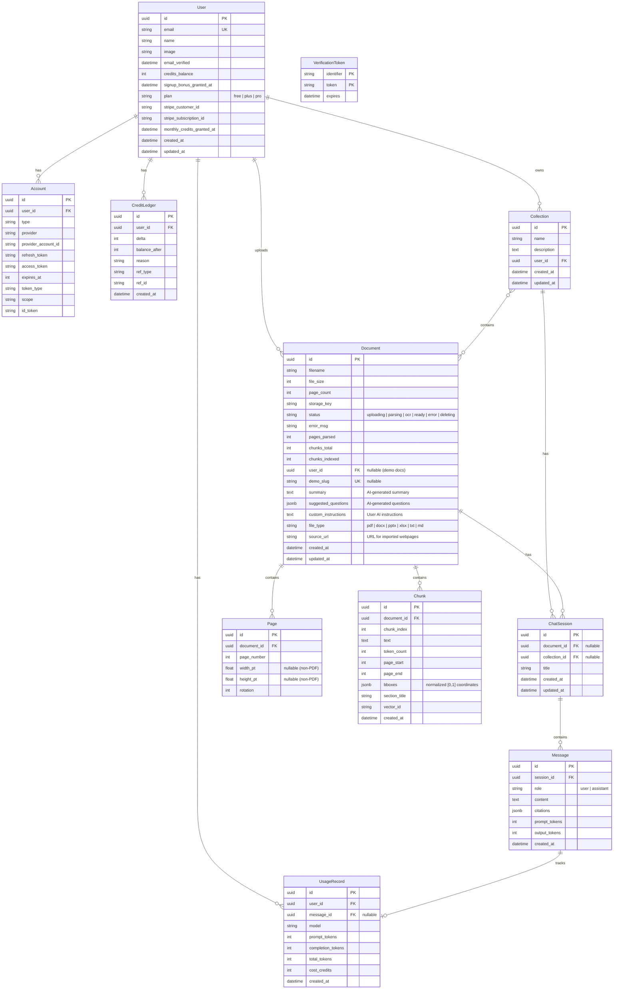

# DocTalk Architecture

[中文版](ARCHITECTURE.zh.md)

This document provides a deep-dive into DocTalk's architecture with Mermaid diagrams covering system topology, data flows, authentication, billing, database schema, and frontend component structure.

---

## 1. System Overview

**Component roles:**

| Component | Role |
|-----------|------|
| **Next.js** | Client-side rendered SPA (`"use client"`), handles routing, i18n, and UI state (Zustand) |
| **Auth.js v5** | Google OAuth authentication, encrypted JWE session tokens |
| **API Proxy** | Translates JWE tokens to HS256 JWT, injects `Authorization` header for all backend requests |
| **FastAPI** | REST API + SSE streaming for chat, document management, billing, user accounts |
| **Celery** | Async document parsing: text extraction (PDF/DOCX/PPTX/XLSX/TXT/MD/URL) → chunking → embedding → vector indexing |
| **PostgreSQL** | Primary data store for users, documents, pages, chunks, sessions, messages, credits |
| **Qdrant** | Vector database for semantic search (COSINE similarity, 1536 dimensions) |
| **Redis** | Celery task broker and result backend |
| **MinIO** | S3-compatible object storage for uploaded PDFs |
| **OpenRouter** | Unified gateway for LLM inference and text embedding |
| **Stripe** | Payment processing for credit purchases and Plus/Pro subscriptions (monthly + annual) |
| **Sentry** | Error tracking and performance monitoring for both backend (FastAPI + Celery) and frontend (Next.js) |

---

## 2. PDF Upload & Parse Pipeline

**Step-by-step:**

1. **Upload**: Browser sends PDF via multipart form through the API proxy. Backend stores the file in MinIO and creates a document record.

2. **Text Extraction**: Celery worker downloads the PDF and uses **PyMuPDF (fitz)** to extract text with bounding-box coordinates per page. Coordinates are normalized to `[0, 1]` range (top-left origin).

3. **Chunking**: Text is split into 300–500 token windows with:
   - Heading detection for section titles
   - Header/footer filtering to remove repeated page elements
   - Each chunk stores `page_start`, `page_end`, and `bboxes` (JSONB array of normalized rectangles)

4. **Embedding**: Chunks are sent to OpenRouter's `openai/text-embedding-3-small` endpoint in batches, producing 1536-dimensional vectors.

5. **Vector Indexing**: Vectors are upserted into Qdrant's `doc_chunks` collection with COSINE similarity metric. The collection dimension is configuration-driven (`EMBEDDING_DIM`).

6. **Completion**: Document status transitions from `parsing` → `ready`. The frontend polls status and transitions to the document viewer.

7. **Auto-Summary** (best-effort): After status becomes `ready`, the worker loads the first 20 chunks and calls a budget LLM (DeepSeek) to generate a 2–3 paragraph summary and 5 suggested questions. Results are stored in the `summary` and `suggested_questions` columns. Failures are logged but do not affect document status.

---

## 3. Chat & Citation Flow

**Key components:**

- **Retrieval**: Top-5 chunks by COSINE vector similarity from Qdrant. Each chunk includes text, page numbers, and bounding boxes.

- **LLM Prompt**: System prompt instructs the model to cite sources using `[n]` notation matching the numbered document fragments provided.

- **RefParserFSM**: A finite state machine in `chat_service.py` that handles `[n]` citation markers split across streaming token boundaries. For example, token `"[1"` followed by `"]"` is correctly parsed as citation reference 1.

- **Frontend Rendering**: `renumberCitations()` in ChatPanel reassigns citation numbers to a sequential series `[1], [2], [3]...` based on order of appearance, regardless of the backend's original numbering.

- **PDF Highlight**: When a user clicks a citation, the PDF viewer scrolls to the referenced page and renders translucent overlay rectangles using the chunk's normalized bbox coordinates multiplied by the page's pixel dimensions.

---

## 4. Authentication Flow

**Why dual JWT?**

Auth.js v5 encrypts session tokens as JWE (JSON Web Encryption), which the Python backend cannot decrypt without sharing the encryption key and matching the exact encryption algorithm. Instead of coupling the two systems:

1. The **API proxy** (`/api/proxy/[...path]/route.ts`) decrypts the JWE using Auth.js's built-in `getToken()` function
2. It creates a new **HS256-signed JWT** with just `sub` (user ID), `iat`, and `exp` claims
3. The backend validates this simple JWT using the shared `AUTH_SECRET`

This cleanly separates the frontend auth system from the backend API authentication.

**Internal Auth Adapter**: Auth.js uses a custom adapter that calls the FastAPI backend's `/api/internal/auth/*` endpoints (protected by `X-Adapter-Secret` header) to manage users, accounts, and verification tokens in PostgreSQL.

---

## 5. Billing & Credits Flow

**Credit lifecycle:**

1. **Signup Bonus**: New users receive 10,000 credits on first login (idempotent, `signup_bonus_granted_at` timestamp guards against double-grant).

2. **Monthly Grant**: `ensure_monthly_credits()` is called before every chat request. It checks `monthly_credits_granted_at` — if 30+ days have elapsed, grants Free (5K), Plus (30K), or Pro (150K) credits based on the user's plan. The ledger entry uses `ref_type=monthly_grant` with a timestamp-based `ref_id` for idempotency.

3. **One-Time Purchase**: Stripe Checkout creates a payment session. On `checkout.session.completed` webhook (mode=payment), credits are added to the user's balance.

4. **Plus/Pro Subscription**: Stripe recurring subscription (monthly or annual). On `invoice.payment_succeeded` webhook, monthly credits are granted based on plan (Plus: 30K, Pro: 150K). Idempotent by `invoice.id`. On `customer.subscription.deleted`, plan is reset to Free.

5. **Chat Debit**: Each chat message deducts credits based on model and token usage. The cost is recorded in both `CreditLedger` (balance tracking) and `UsageRecord` (analytics).

---

## 6. Database Schema

**Key relationships:**

- `User → Document`: SET NULL on delete (demo documents have `user_id = NULL`)
- `User → Account/CreditLedger/UsageRecord`: CASCADE delete
- `Document → Page/Chunk/ChatSession`: CASCADE delete
- `ChatSession → Message`: CASCADE delete
- `Message → UsageRecord`: SET NULL on delete
- `User → Collection`: CASCADE delete
- `Collection → ChatSession`: CASCADE delete (via collection_id)
- `Collection ↔ Document`: Many-to-many via `collection_documents` junction table

**Unique constraints:**
- `(Document.document_id, Page.page_number)` — one page per number per document
- `(Document.document_id, Chunk.chunk_index)` — sequential chunk ordering
- `(Account.provider, Account.provider_account_id)` — one account link per provider
- `Document.demo_slug` — unique when not NULL

---

## 7. Frontend Component Tree

**Header variants:**
- `variant="minimal"` — Logo + UserMenu only (transparent background) — used on Home, Demo, Auth pages
- `variant="full"` — All controls (ModelSelector, LanguageSelector, SessionDropdown, CreditsDisplay, UserMenu) — used on Document, Billing, Profile pages

**Landing page sections** (in order): HeroSection → Product Showcase → HowItWorks → FeatureGrid → SocialProof → SecuritySection → FAQ → FinalCTA → PrivacyBadge → Footer

**Chat features:**
- **Auto-Summary**: New sessions inject a synthetic assistant message with the AI-generated document summary
- **Suggested Questions**: Document-specific questions replace static i18n defaults when available
- **Regenerate**: Re-send the last user message to get a new AI response
- **Export**: Download the full conversation as a Markdown file with citations converted to footnotes

**PDF Search**: Ctrl+F triggers an in-viewer search bar. Text is extracted via `pdfjs page.getTextContent()`, matches are highlighted using `customTextRenderer` with `<mark>` tags, and prev/next navigation scrolls between matches.

**State management:**
- **Zustand store** manages document state, selected model, active session, PDF viewer state, search state (query, matches, currentMatchIndex), document summary, and suggested questions
- **Auth.js SessionProvider** wraps the entire app via `Providers.tsx`

---

## 8. Infrastructure & Deployment

**Deployment details:**

| Aspect | Frontend (Vercel) | Backend (Railway) |
|--------|-------------------|-------------------|
| **Trigger** | `git push` (auto) | `railway up --detach` (manual) |
| **Build** | Next.js static export from `frontend/` | Dockerfile from project root |
| **Runtime** | Serverless functions (Hobby plan) | Single container (`entrypoint.sh`): alembic → celery (auto-restart) → uvicorn |
| **Domain** | `www.doctalk.site` | `backend-production-a62e.up.railway.app` |
| **Limits** | 4.5 MB function body, 60s max duration | Container memory based on Railway plan |

**Environment sync:**
- `AUTH_SECRET` and `ADAPTER_SECRET` must match between Vercel and Railway
- `NEXT_PUBLIC_API_BASE` on Vercel must point to the Railway backend URL
- `BACKEND_INTERNAL_URL` on Vercel is the same Railway URL (used by the auth adapter)
