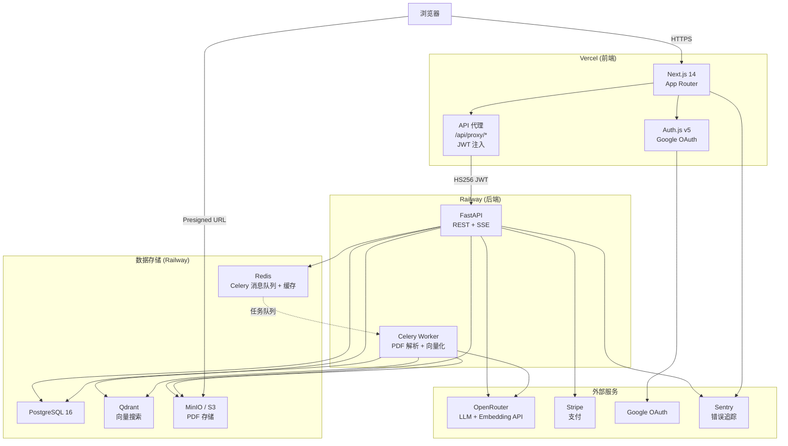
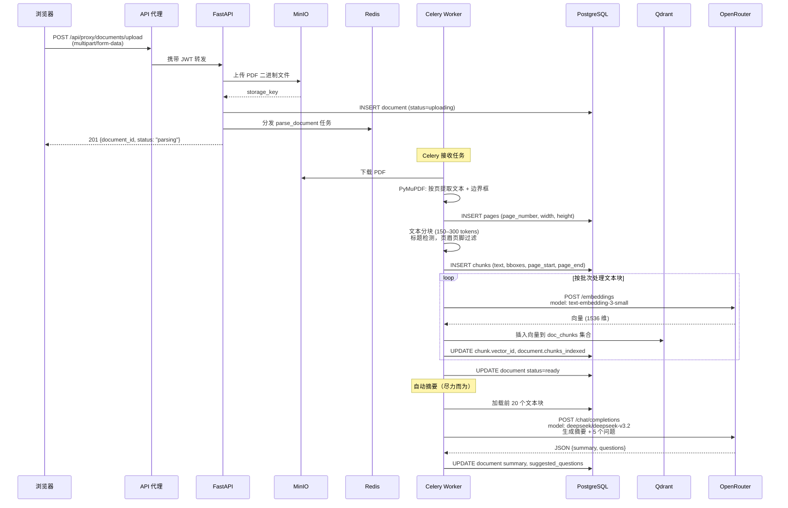
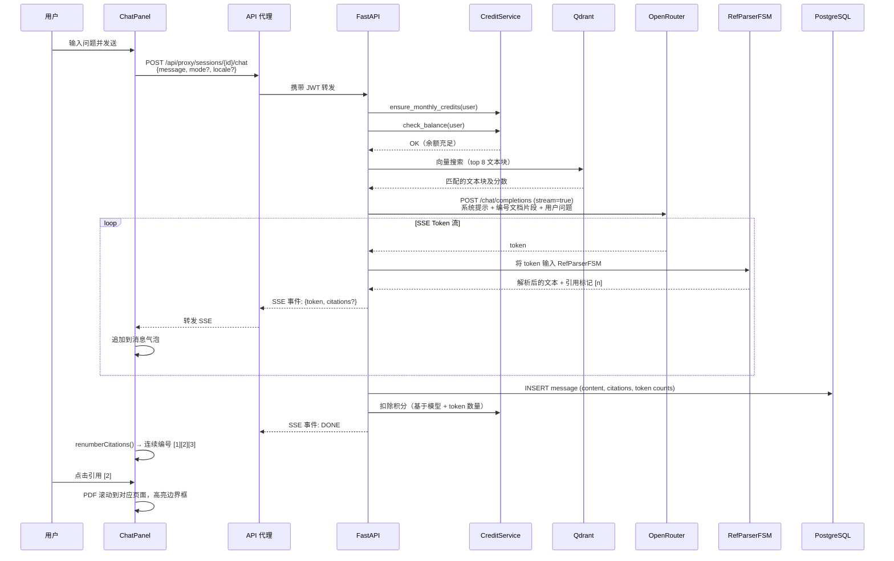
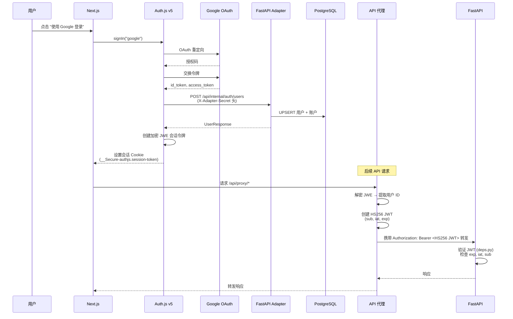
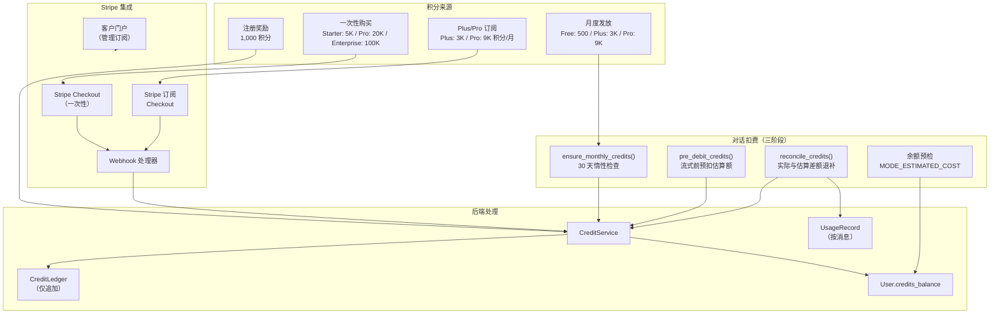
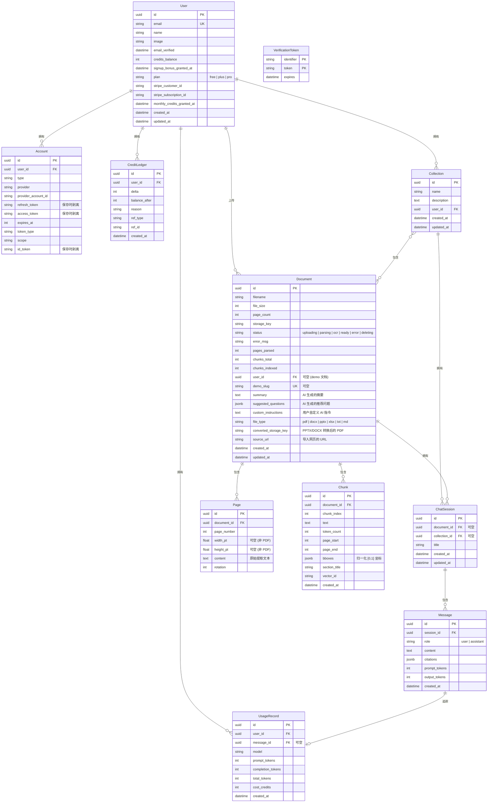
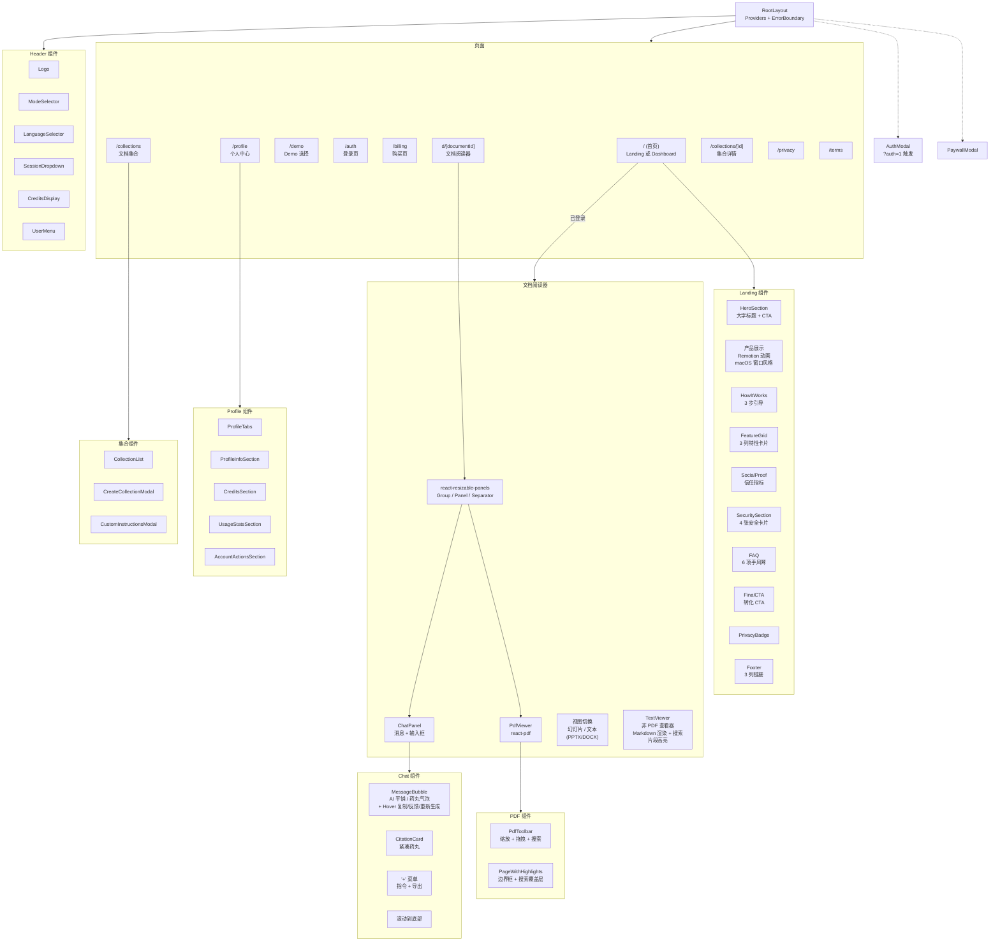
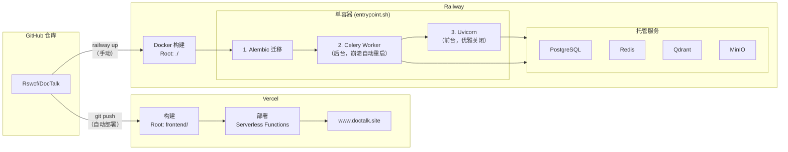

# DocTalk 架构文档

[English](ARCHITECTURE.md)

本文档通过 Mermaid 图表深入介绍 DocTalk 的架构，涵盖系统拓扑、数据流、认证、计费、数据库模型和前端组件结构。

---

## 1. 系统总览

**各组件职责：**

| 组件 | 职责 |
|------|------|
| **Next.js** | 客户端渲染 SPA（`"use client"`），负责路由、国际化和 UI 状态管理（Zustand） |
| **Auth.js v5** | Google OAuth 认证，加密 JWE 会话令牌 |
| **API 代理** | 将 JWE 令牌转换为 HS256 JWT，为所有后端请求注入 `Authorization` 头 |
| **FastAPI** | REST API + SSE 流式传输，处理对话、文档管理、计费、用户账户 |
| **Celery** | 异步文档解析：文本提取 (PDF/DOCX/PPTX/XLSX/TXT/MD/URL) → 分块 → 向量化 → 索引。PPTX/DOCX 文件还通过 LibreOffice headless 转换为 PDF 进行可视化渲染 |
| **PostgreSQL** | 主数据存储：用户、文档、页面、文本块、会话、消息、积分 |
| **Qdrant** | 向量数据库，语义搜索（COSINE 相似度，1536 维） |
| **Redis** | Celery 任务代理和结果后端 |
| **MinIO** | S3 兼容对象存储，用于上传的文件，SSE-S3 静态加密 |
| **OpenRouter** | LLM 推理和文本向量化的统一网关 |
| **Stripe** | 积分购买和 Plus/Pro 订阅（月付 + 年付）的支付处理 |
| **Sentry** | 后端（FastAPI + Celery）和前端（Next.js）的错误追踪与性能监控 |

---

## 2. PDF 上传与解析流水线

**逐步说明：**

1. **上传**：浏览器通过 API 代理以 multipart 表单发送 PDF。后端校验按套餐的文档数量和文件大小限制，执行 magic-byte 文件验证（PDF `%PDF` 头、Office ZIP 结构 + `[Content_Types].xml`、500MB zip bomb 防护），清洗文件名（Unicode 规范化、控制字符剥离、双扩展名阻断），将文件以 SSE-S3 加密存储到 MinIO，并创建文档记录。

2. **文本提取**：Celery Worker 下载 PDF，使用 **PyMuPDF (fitz)** 按页提取文本及边界框坐标。坐标归一化到 `[0, 1]` 范围（左上角原点）。

3. **分块**：文本被分割为 150–300 token 的窗口，具有以下特性：
   - 标题检测用于识别章节标题
   - 页眉/页脚过滤以移除重复的页面元素
   - 每个文本块存储 `page_start`、`page_end` 和 `bboxes`（归一化矩形的 JSONB 数组）

4. **向量化**：文本块按批次发送到 OpenRouter 的 `openai/text-embedding-3-small` 端点，生成 1536 维向量。

5. **向量索引**：向量插入到 Qdrant 的 `doc_chunks` 集合中，使用 COSINE 相似度度量。集合维度由配置驱动（`EMBEDDING_DIM`）。

6. **完成**：文档状态从 `parsing` 转换为 `ready`。前端轮询状态并切换到文档阅读器。

7. **自动摘要**（尽力而为）：状态变为 `ready` 后，Worker 加载前 20 个文本块，调用预算 LLM（DeepSeek）生成 2–3 段摘要和 5 个推荐问题。结果存储在 `summary` 和 `suggested_questions` 列中。失败仅记录日志，不影响文档状态。

---

## 3. 对话与引用流程

**关键组件：**

- **检索**：从 Qdrant 按 COSINE 向量相似度检索 Top-8 文本块。每个文本块包含文本、页码和边界框。

- **LLM 提示词**：系统提示指示模型使用 `[n]` 标记引用来源，编号对应提供的文档片段。匿名 Demo 用户使用低成本模型（`DEMO_LLM_MODEL`，默认 DeepSeek V3.2）以降低 API 成本。**模型自适应提示系统**（`model_profiles.py`）为每个模型定制规则部分和 API 参数：DeepSeek 使用 `positive_framing` 避免消极表述过度遵从，其他模型使用 `default` 风格。temperature、max_tokens 和功能标志（stream_options）也按模型配置。

- **RefParserFSM**：`chat_service.py` 中的有限状态机，处理流式 token 中跨边界的 `[n]` 引用标记。例如，token `"[1"` 后跟 `"]"` 会被正确解析为引用标记 1。

- **前端渲染**：ChatPanel 中的 `renumberCitations()` 将引用编号按出现顺序重新分配为连续序列 `[1], [2], [3]...`，不依赖后端的原始编号。

- **PDF 高亮**：当用户点击引用时，PDF 查看器滚动到对应页面，使用文本块的归一化边界框坐标乘以页面像素尺寸，渲染半透明覆盖矩形。

---

## 4. 认证流程

**为什么需要双层 JWT？**

Auth.js v5 将会话令牌加密为 JWE（JSON Web Encryption），Python 后端无法在不共享加密密钥和匹配加密算法的情况下解密。我们没有耦合两个系统，而是采用了以下方案：

1. **API 代理**（`/api/proxy/[...path]/route.ts`）使用 Auth.js 内置的 `getToken()` 函数解密 JWE
2. 创建新的 **HS256 签名 JWT**，仅包含 `sub`（用户 ID）、`iat` 和 `exp` 声明
3. 后端使用共享的 `AUTH_SECRET` 验证这个简单的 JWT

这样可以干净地将前端认证系统与后端 API 认证分离。

**内部 Auth Adapter**：Auth.js 使用自定义 Adapter，调用 FastAPI 后端的 `/api/internal/auth/*` 端点（通过 `X-Adapter-Secret` 头保护）来管理 PostgreSQL 中的用户、账户和验证令牌。

---

## 5. 计费与积分流程

**积分生命周期：**

1. **注册奖励**：新用户首次登录获得 1,000 积分（通过 `SIGNUP_BONUS_CREDITS` 配置；幂等操作，`signup_bonus_granted_at` 时间戳防止重复发放）。

2. **月度发放**：`ensure_monthly_credits()` 在每次对话请求前调用。检查 `monthly_credits_granted_at` — 若已过 30 天以上，根据用户套餐发放 Free（500）、Plus（3K）或 Pro（9K）积分。Ledger 条目使用 `ref_type=monthly_grant` 和基于时间戳的 `ref_id` 保证幂等性。

3. **一次性购买**：Stripe Checkout 创建支付会话。收到 `checkout.session.completed` Webhook（mode=payment）后，将积分添加到用户余额。按 `payment_intent` ID 幂等。

4. **Plus/Pro 订阅**：Stripe 循环订阅（月付或年付）。`checkout.session.completed`（mode=subscription）仅更新用户套餐——**不发放积分**（防止与 invoice Webhook 双重发放）。积分仅通过 `invoice.payment_succeeded` Webhook 发放（Plus: 3K，Pro: 9K），按 `invoice.id` 幂等。收到 `customer.subscription.deleted` 后将套餐重置为 Free。

5. **对话扣费（三阶段）**：① `chat.py` 预检余额 >= `MODE_ESTIMATED_COST`（quick=5, balanced=15, thorough=35），不足返回 402。② `chat_service.py` 调用 `pre_debit_credits()` 在 LLM 流式输出前预扣估算额。③ 流式结束后 `reconcile_credits()` 按实际 token 用量计算差额退补。所有操作记录在 `CreditLedger`（余额追踪）和 `UsageRecord`（分析统计）中。

---

## 6. 数据库模型

**关键关系：**

- `User → Document`：删除时 SET NULL（demo 文档的 `user_id = NULL`）
- `User → Account/CreditLedger/UsageRecord`：CASCADE 删除
- `Document → Page/Chunk/ChatSession`：CASCADE 删除
- `ChatSession → Message`：CASCADE 删除
- `Message → UsageRecord`：删除时 SET NULL
- `User → Collection`：CASCADE 删除
- `Collection → ChatSession`：CASCADE 删除（通过 collection_id）
- `Collection ↔ Document`：多对多关系，通过 `collection_documents` 关联表

**唯一约束：**
- `(Document.document_id, Page.page_number)` — 每个文档每个页码唯一
- `(Document.document_id, Chunk.chunk_index)` — 文本块顺序编号
- `(Account.provider, Account.provider_account_id)` — 每个提供商一个账户链接
- `Document.demo_slug` — 非空时唯一

---

## 7. 前端组件树

**Header 变体：**
- `variant="minimal"` — 仅 Logo + UserMenu（透明背景）— 用于首页、Demo、登录页
- `variant="full"` — 所有控件（ModeSelector、ThemeSelector、LanguageSelector、SessionDropdown、CreditsDisplay、UserMenu）— 用于文档页、购买页、个人中心。ThemeSelector 为下拉菜单（Light/Dark/Windows 98），替代原先的图标循环按钮。额外支持 `isDemo`/`isLoggedIn` props，匿名 Demo 用户时隐藏 ModeSelector

**Landing 页面各区块**（按顺序）：HeroSection → 产品展示（Remotion `<Player>` 动画演示，300帧@30fps，lazy-loaded）→ HowItWorks → FeatureGrid → SocialProof → SecuritySection → FAQ → FinalCTA → PrivacyBadge → Footer

**Chat 功能：**
- **ChatGPT 风格 UI**：AI 消息无卡片/边框/背景，基础 `prose` 级别全宽渲染；用户消息 `rounded-3xl` 圆角气泡（浅色模式 `bg-zinc-100`，深色模式 `dark:bg-zinc-700`）。消息区域 + 输入栏使用 `max-w-3xl mx-auto` 居中，宽面板时保持舒适阅读宽度。操作按钮（复制/点赞/点踩/重新生成）在旧消息上 hover 显示（`opacity-0 group-hover:opacity-100`），最新 AI 消息始终可见
- **排版精修**：body 添加 `antialiased` 字体渲染，Retina 屏上更细腻。prose 正文颜色从 Tailwind Typography 默认 gray-700（`#374151`）覆盖为 zinc-950（`#09090b`，近纯黑）；dark mode 为 zinc-50（`#fafafa`）。段落和列表间距收紧，chat 输出更紧凑易读
- **代码块**：`PreBlock` 组件拦截 `<pre>` 元素，渲染为深色背景代码块（`bg-zinc-900`），顶部 header bar（`bg-zinc-800`）显示语言标签 + Copy code 按钮。`not-prose` 避免 Typography 样式干扰。内联 `code` 渲染为灰色背景药丸（通过 Typography 配置去除反引号装饰）
- **输入栏**：`rounded-3xl` 药丸形容器 + `shadow-sm` 静态阴影提升层次感。左侧 "+" 按钮弹出下拉菜单（自定义指令 + 导出对话）。右侧 Send/Stop 切换（streaming 时显示 Square 停止按钮，通过 `AbortController` 中止 SSE）。输入栏下方显示免责声明（11 语言）
- **滚动到底部**：滚动离底部 >80px 时显示浮动 ArrowDown 按钮
- **紧凑引用**：`CitationCard` 渲染为 `rounded-lg` 内联药丸，`flex-wrap` 水平排列（非全宽竖向卡片）
- **推荐问题**：`rounded-full` 药丸按钮 + 居中 flex-wrap 布局
- **自动摘要**：新会话注入一条合成的 assistant 消息，展示 AI 生成的文档摘要
- **重新生成**：重新发送上一条用户消息，获取新的 AI 回答
- **导出**：将完整对话下载为 Markdown 文件，引用转为脚注（通过 "+" 菜单访问）

**PDF 搜索**：Ctrl+F 触发阅读器内搜索栏。通过 `pdfjs page.getTextContent()` 提取文本，使用 `customTextRenderer` 的 `<mark>` 标签高亮匹配，上下翻页在匹配项之间滚动。

**状态管理：**
- **Zustand store** 管理文档状态、选中模型、活跃会话、PDF 查看器状态、搜索状态（query/matches/currentMatchIndex）、文档摘要和推荐问题
- **Auth.js SessionProvider** 通过 `Providers.tsx` 包裹整个应用

---

## 8. 安全与合规

### 安全层级

| 层级 | 机制 |
|------|------|
| **SSRF 防护** | `url_validator.py` — DNS 解析 + 私有 IP 阻断（RFC 1918、链路本地、云元数据 `169.254.169.254`），内部端口封锁（5432/6379/6333/9000），手动重定向跟踪（最多 3 跳）并逐跳验证 |
| **文件验证** | Magic-byte 检查：PDF `%PDF` 头、Office ZIP 结构 + `[Content_Types].xml`、500MB zip bomb 防护。双扩展名阻断（`.pdf.exe` → `_pdf.exe`） |
| **静态加密** | MinIO SSE-S3 应用于所有 `put_object()` 调用 + bucket 级默认加密策略 |
| **按套餐限制** | FREE: 3 文档 / 25MB，PLUS: 20 文档 / 50MB，PRO: 999 文档 / 100MB — 在上传端点强制执行 |
| **文件名清洗** | Unicode NFC 规范化、控制字符剥离、双扩展名阻断、200 字符截断 — 前端（`utils.ts`）和后端同时执行 |
| **速率限制** | 内存级 token-bucket 限制匿名 chat（10 req/min/IP），bucket 字典超 10K 条目时自动清理 |
| **OAuth 令牌清理** | `link_account()` 剥离 access_token、refresh_token 和 id_token — DocTalk 仅存储身份绑定信息（provider + provider_account_id） |
| **非 root Docker** | 容器以 `app` 用户（UID 1001）运行，非 root |
| **删除验证** | MinIO/Qdrant 清理失败时排入 Celery 重试任务（`deletion_worker.py`，3 次重试，指数退避）；结构化安全日志替代静默异常吞没 |
| **安全事件日志** | `security_log.py` 输出结构化 JSON 日志：认证失败、速率限制命中、SSRF 阻断、文件上传、文档删除、账户删除 |

### 隐私与合规

| 要求 | 实现 |
|------|------|
| **GDPR Art. 17（被遗忘权）** | `DELETE /api/users/me` — 级联删除所有用户数据，取消 Stripe 订阅，清理 MinIO + Qdrant |
| **GDPR Art. 20（数据可携带性）** | `GET /api/users/me/export` — JSON 导出所有用户数据（个人信息、文档、会话、消息、积分、使用记录） |
| **GDPR ePrivacy（Cookie）** | `CookieConsentBanner.tsx` — Accept/Decline 横栏；`AnalyticsWrapper.tsx` 仅在同意后条件加载 Vercel Analytics；consent 存储在 localStorage |
| **AI 处理披露** | `AuthModal` 显示 `auth.aiDisclosure` 通知：文档由第三方 AI 服务（OpenRouter）处理 |
| **CCPA（禁止出售）** | Footer Legal 列包含 "Do Not Sell My Info" 链接 |
| **虚假声明移除** | 11 种语言的 i18n 文件已修正：移除 "端到端加密"、"30 天自动删除"、"不与第三方共享"、"我们不保留任何内容"，替换为准确描述 |

---

## 9. 基础设施与部署

**部署详情：**

| 方面 | 前端 (Vercel) | 后端 (Railway) |
|------|---------------|----------------|
| **触发方式** | `git push`（自动） | `railway up --detach`（手动） |
| **构建** | 从 `frontend/` 导出 Next.js | 从项目根目录构建 Dockerfile（含 LibreOffice headless + CJK 字体，用于 PPTX/DOCX→PDF 转换） |
| **运行时** | Serverless 函数（Hobby 计划） | 单容器（`entrypoint.sh`）：alembic → celery（自动重启）→ uvicorn |
| **域名** | `www.doctalk.site` | `backend-production-a62e.up.railway.app` |
| **限制** | 4.5 MB 函数体积，60s 最大时长 | 容器内存取决于 Railway 计划 |

**环境变量同步：**
- `AUTH_SECRET` 和 `ADAPTER_SECRET` 在 Vercel 和 Railway 之间必须一致
- Vercel 上的 `NEXT_PUBLIC_API_BASE` 必须指向 Railway 后端 URL
- Vercel 上的 `BACKEND_INTERNAL_URL` 是相同的 Railway URL（Auth Adapter 使用）
