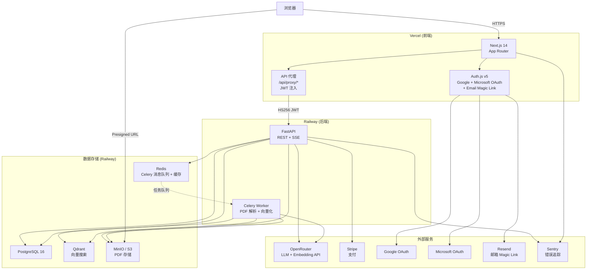
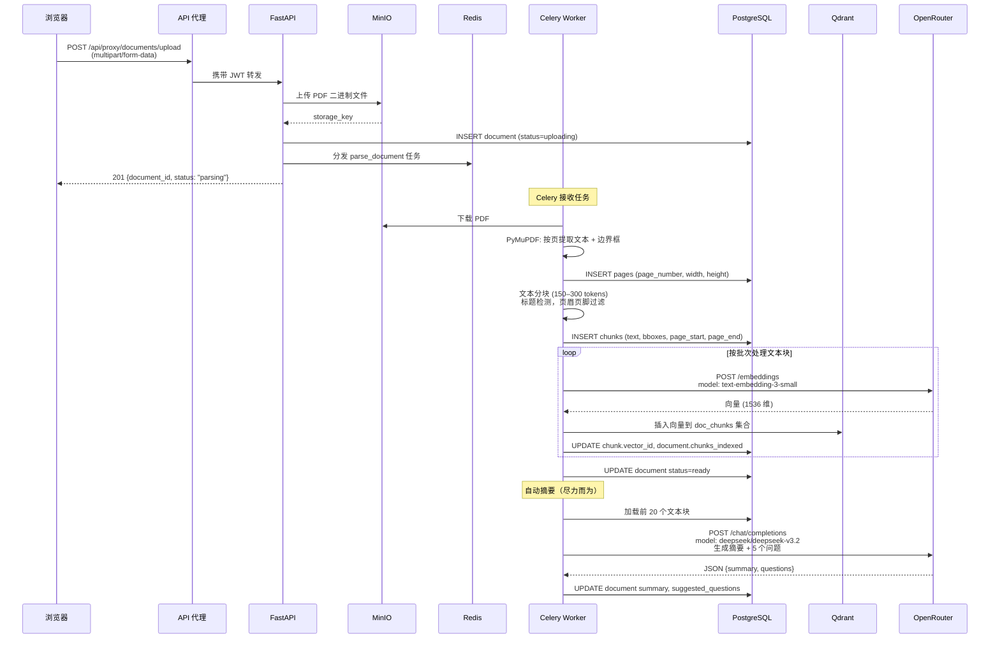
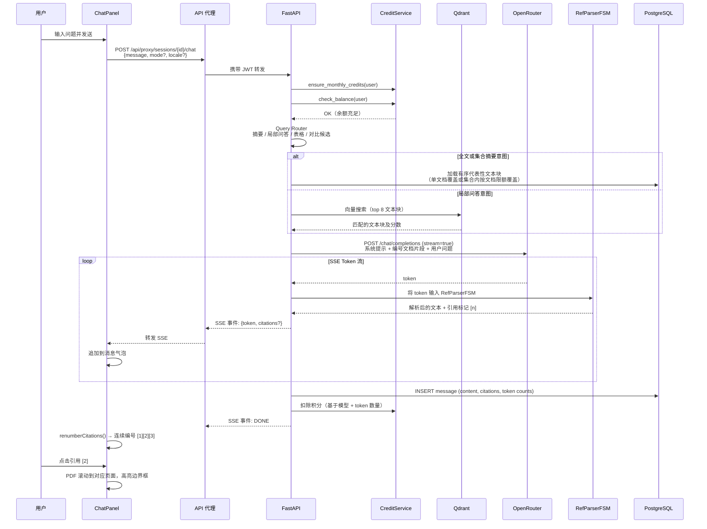
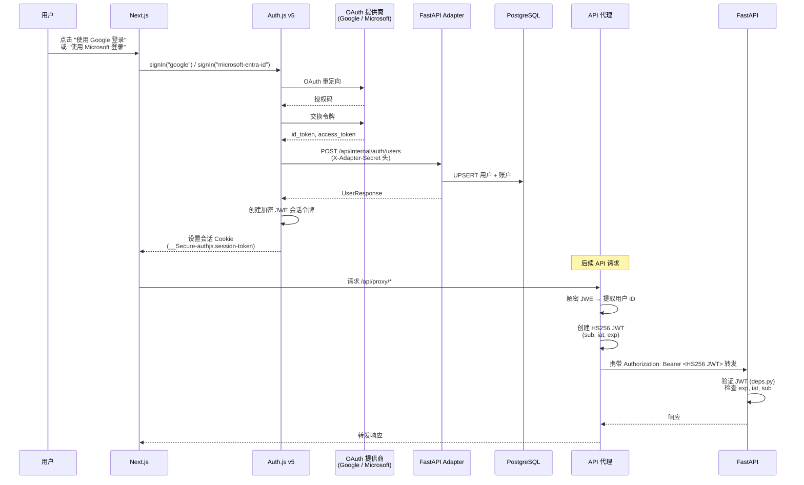
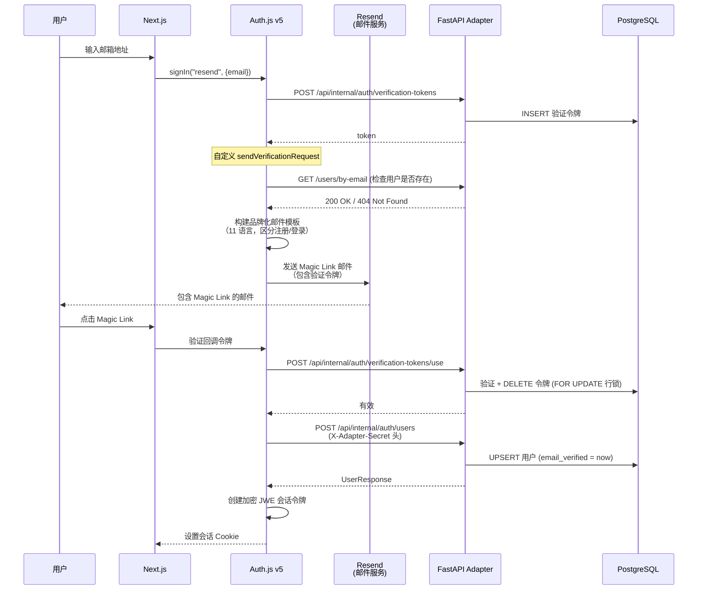
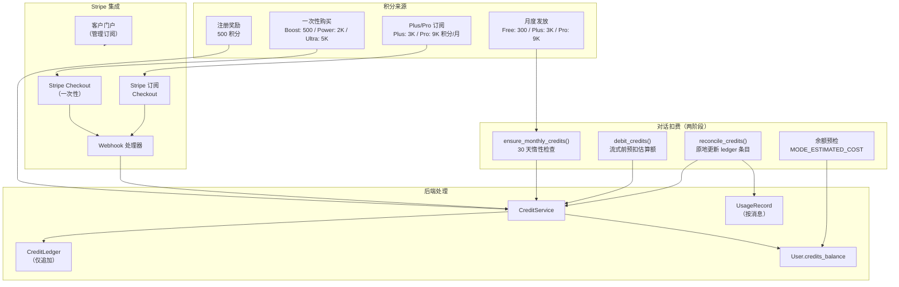
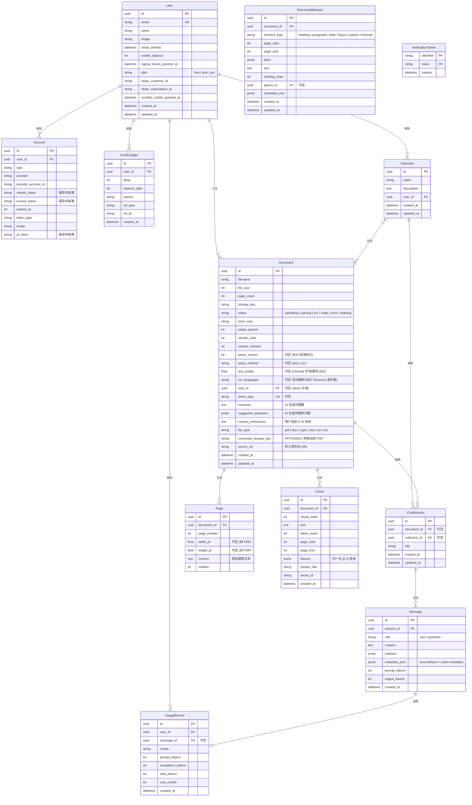
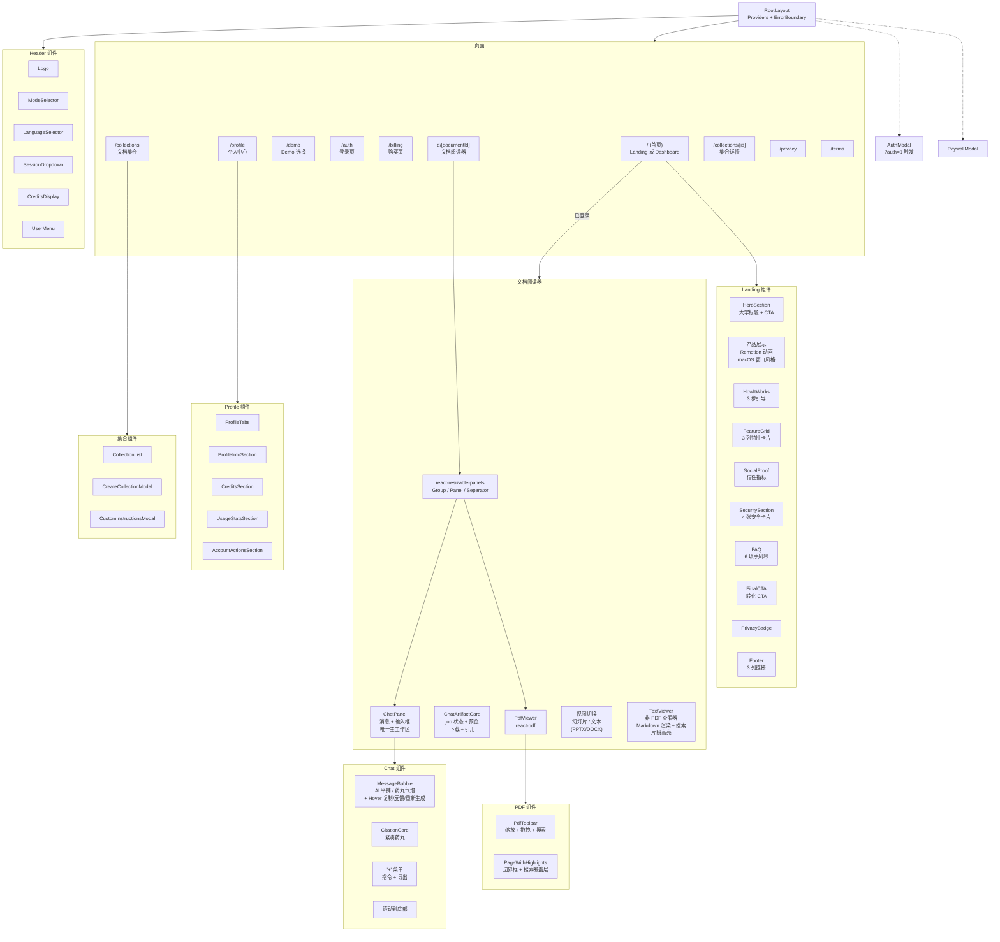
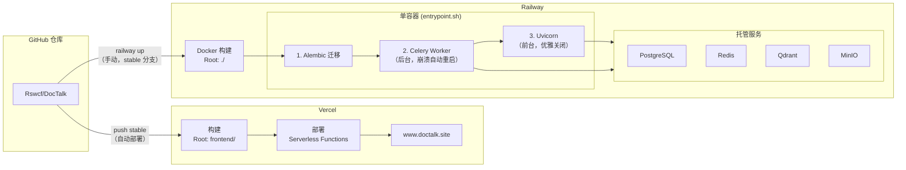

# DocTalk 架构文档

[English](ARCHITECTURE.md)

本文档通过 Mermaid 图表深入介绍 DocTalk 的架构，涵盖系统拓扑、数据流、认证、计费、数据库模型和前端组件结构。

---

## 1. 系统总览

```mermaid
graph TB
    Browser["浏览器"]

    subgraph Vercel["Vercel (前端)"]
        NextJS["Next.js 14<br/>App Router"]
        AuthJS["Auth.js v5<br/>Google + Microsoft OAuth<br/>+ Email Magic Link"]
        Proxy["API 代理<br/>/api/proxy/*<br/>JWT 注入"]
    end

    subgraph Railway["Railway (后端)"]
        FastAPI["FastAPI<br/>REST + SSE"]
        Celery["Celery Worker<br/>PDF 解析 + 向量化"]
    end

    subgraph DataStores["数据存储 (Railway)"]
        PG["PostgreSQL 16"]
        Qdrant["Qdrant<br/>向量搜索"]
        Redis["Redis<br/>Celery 消息队列 + 缓存"]
        MinIO["MinIO / S3<br/>PDF 存储"]
    end

    subgraph External["外部服务"]
        OpenRouter["OpenRouter<br/>LLM + Embedding API"]
        Stripe["Stripe<br/>支付"]
        Google["Google OAuth"]
        Microsoft["Microsoft OAuth"]
        Resend["Resend<br/>邮箱 Magic Link"]
        Sentry["Sentry<br/>错误追踪"]
    end

    Browser -->|HTTPS| NextJS
    NextJS --> AuthJS
    NextJS --> Proxy
    Proxy -->|HS256 JWT| FastAPI
    FastAPI --> PG
    FastAPI --> Qdrant
    FastAPI --> Redis
    FastAPI --> MinIO
    FastAPI --> OpenRouter
    FastAPI --> Stripe
    Celery --> PG
    Celery --> Qdrant
    Celery --> MinIO
    Celery --> OpenRouter
    Redis -.->|任务队列| Celery
    AuthJS --> Google
    AuthJS --> Microsoft
    AuthJS --> Resend
    FastAPI --> Sentry
    NextJS --> Sentry
    Browser -->|Presigned URL| MinIO
```

**各组件职责：**

| 组件 | 职责 |
|------|------|
| **Next.js** | 客户端渲染 SPA（`"use client"`），负责路由、国际化和 UI 状态管理（Zustand） |
| **Auth.js v5** | 通过 3 种方式认证：Google OAuth、Microsoft OAuth 和邮箱 Magic Link（via Resend）。加密 JWE 会话令牌 |
| **API 代理** | 将 JWE 令牌转换为 HS256 JWT，为所有后端请求注入 `Authorization` 头 |
| **FastAPI** | REST API + SSE 流式传输，处理对话、文档管理、计费、用户账户 |
| **Celery** | 异步文档解析：文本提取 (PDF/DOCX/PPTX/XLSX/TXT/MD/URL) → 分块 → 向量化 → 索引。PPTX/DOCX 文件还通过 LibreOffice headless 转换为 PDF 进行可视化渲染 |
| **PostgreSQL** | 主数据存储：用户、文档、页面、文本块、会话、消息、积分 |
| **Qdrant** | 向量数据库，语义搜索（COSINE 相似度，1536 维） |
| **Redis** | Celery 任务代理和结果后端 |
| **MinIO** | S3 兼容对象存储，用于上传的文件，SSE-S3 静态加密 |
| **OpenRouter** | LLM 推理和文本向量化的统一网关 |
| **Stripe** | 积分购买和 Plus/Pro 订阅（月付 + 年付）的支付处理 |
| **Sentry** | 后端（FastAPI + Celery）和前端（Next.js）的错误追踪与性能监控 |

---

## 2. PDF 上传与解析流水线

```mermaid
sequenceDiagram
    participant B as 浏览器
    participant P as API 代理
    participant API as FastAPI
    participant S3 as MinIO
    participant R as Redis
    participant W as Celery Worker
    participant DB as PostgreSQL
    participant Q as Qdrant
    participant OR as OpenRouter

    B->>P: POST /api/proxy/documents/upload<br/>(multipart/form-data)
    P->>API: 携带 JWT 转发
    API->>S3: 上传 PDF 二进制文件
    S3-->>API: storage_key
    API->>DB: INSERT document (status=uploading)
    API->>R: 分发 parse_document 任务
    API-->>B: 201 {document_id, status: "parsing"}

    Note over W: Celery 接收任务
    W->>S3: 下载 PDF
    W->>W: PyMuPDF: 按页提取文本 + 边界框
    W->>DB: INSERT pages (page_number, width, height)
    W->>W: 文本分块 (150–300 tokens)<br/>标题检测，页眉页脚过滤
    W->>DB: INSERT chunks (text, bboxes, page_start, page_end)

    loop 按批次处理文本块
        W->>OR: POST /embeddings<br/>model: text-embedding-3-small
        OR-->>W: 向量 (1536 维)
        W->>Q: 插入向量到 doc_chunks 集合
        W->>DB: UPDATE chunk.vector_id, document.chunks_indexed
    end

    W->>DB: UPDATE document status=ready

    Note over W: 自动摘要（尽力而为）
    W->>DB: 加载前 20 个文本块
    W->>OR: POST /chat/completions<br/>model: deepseek/deepseek-v3.2<br/>生成摘要 + 5 个问题
    OR-->>W: JSON {summary, questions}
    W->>DB: UPDATE document summary, suggested_questions
```

**逐步说明：**

1. **上传**：浏览器通过 API 代理以 multipart 表单发送 PDF。后端校验按套餐的文档数量和文件大小限制，执行 magic-byte 文件验证（PDF `%PDF` 头、Office ZIP 结构 + `[Content_Types].xml`、500MB zip bomb 防护），清洗文件名（Unicode 规范化、控制字符剥离、双扩展名阻断），将文件以 SSE-S3 加密存储到 MinIO，并创建文档记录。

2. **文本提取**：Celery Worker 下载 PDF，使用 **PyMuPDF (fitz)** 按页提取文本及边界框坐标。坐标归一化到 `[0, 1]` 范围（左上角原点）。

2a. **OCR 回退**（仅 PDF，状态 → `ocr`）：在两种情况下触发 OCR——文档是**扫描件**（`detect_scanned`，没有文本层），或**低质量**（`detect_low_quality_text`：文本层存在但乱码，例如字体 cmap 损坏导致提取出 mojibake；用 Unicode 感知的字母/数字占比打分，两级阈值，保证正常中日韩文本不会被误判）。OCR 的**语言基于内容判定**：`detect_script_osd` 在样本页上运行 Tesseract OSD（`--psm 0`）检测字符脚本，再由 `resolve_ocr_languages(locale, script)` 选出**窄**的 Tesseract 语言集（同一脚本族，≤3 种，**非拉丁脚本不追加 `eng`**——多余语言会让 Tesseract 产生跨脚本幻觉并大幅变慢）。UI `locale` 仅用于在脚本族内消歧。低质量重跑 OCR 只有在质量优于原文本层时才会被采纳。Worker 在文档上记录 `parse_version`、`parse_method`（`text`/`ocr`）、`text_quality` 和 `ocr_languages`（供 `scripts/find_low_quality_docs.py` 回填修复前解析的旧文档）。

3. **分块**：文本被分割为 150–300 token 的窗口，具有以下特性：
   - 标题检测用于识别章节标题
   - 页眉/页脚过滤以移除重复的页面元素
   - 简单双栏阅读顺序检测，使正文按栏进入 chunk，而不是按同一行左右交错
   - 语言感知的 block 拼接：英文保留必要词间空格，同时避免标点前和相邻中文字符间
     出现多余空格
   - 每个文本块存储 `page_start`、`page_end` 和 `bboxes`（归一化矩形的 JSONB 数组）

4. **向量化**：文本块按批次发送到 OpenRouter 的 `openai/text-embedding-3-small` 端点，生成 1536 维向量。

5. **向量索引**：向量插入到 Qdrant 的 `doc_chunks` 集合中，使用 COSINE 相似度度量。集合维度由配置驱动（`EMBEDDING_DIM`）。

6. **完成**：文档状态从 `parsing` 转换为 `ready`。前端轮询状态并切换到文档阅读器。

7. **自动摘要**（尽力而为）：状态变为 `ready` 后，Worker 加载前 20 个文本块，调用预算 LLM（DeepSeek）生成 2–3 段摘要和 5 个推荐问题。结果存储在 `summary` 和 `suggested_questions` 列中。失败仅记录日志，不影响文档状态。

**幂等重新解析**：重新解析（手动重处理、卡住文档重试或回填）会先**按 `document_id` 删除该文档的 Qdrant 向量，再删除其数据库 pages/chunks**。该顺序至关重要：若 Qdrant 删除失败，Worker 会写入结构化错误并返回、保留现有行，从而保证向量库与关系库不会发生分歧，瞬时故障也不会悄悄丢掉一份原本可用的解析结果。

---

## 3. 对话与引用流程

```mermaid
sequenceDiagram
    participant U as 用户
    participant CP as ChatPanel
    participant P as API 代理
    participant API as FastAPI
    participant CS as CreditService
    participant Q as Qdrant
    participant OR as OpenRouter
    participant FSM as RefParserFSM
    participant DB as PostgreSQL

    U->>CP: 输入问题并发送
    CP->>P: POST /api/proxy/sessions/{id}/chat<br/>{message, mode?, locale?}
    P->>API: 携带 JWT 转发

    API->>CS: ensure_monthly_credits(user)
    API->>CS: check_balance(user)
    CS-->>API: OK（余额充足）

    API->>API: Query Router<br/>摘要 / 局部问答 / 表格 / 对比候选
    alt 全文或集合摘要意图
        API->>DB: 加载有序代表性文本块<br/>（单文档覆盖或集合内按文档限额覆盖）
    else 局部问答意图
        API->>Q: 向量搜索（top 8 文本块）
        Q-->>API: 匹配的文本块及分数
    end

    API->>OR: POST /chat/completions (stream=true)<br/>系统提示 + 编号文档片段 + 用户问题

    loop SSE Token 流
        OR-->>API: token
        API->>FSM: 将 token 输入 RefParserFSM
        FSM-->>API: 解析后的文本 + 引用标记 [n]
        API-->>P: SSE 事件: {token, citations?}
        P-->>CP: 转发 SSE
        CP->>CP: 追加到消息气泡
    end

    API->>DB: INSERT message (content, citations, token counts)
    API->>CS: 扣除积分（基于模型 + token 数量）
    API-->>P: SSE 事件: DONE
    CP->>CP: renumberCitations() → 连续编号 [1][2][3]
    U->>CP: 点击引用 [2]
    CP->>CP: PDF 滚动到对应页面，高亮边界框
```

**关键组件：**

- **Query Router**：聊天请求会先经过一个确定性的、可扩展为多标签的
  router，用来识别摘要、局部问答、表格、对比、引用定位、存在性检查和
  穷尽扫描候选。全文摘要和集合摘要请求不会再进入普通语义 top-k 检索。

- **Query Planner**：对比、多跳、穷尽扫描和多实体指标问题会在 corrective retrieval
  前进入确定性 planner。Planner 会生成有上限的 evidence steps，例如实体-指标覆盖
  和按文档对比覆盖，并用受控 step 名称标记检索片段。原始 planned query 不会被回写
  进 system prompt。

- **检索**：Chunk RAG 继续作为 citation anchor 和普通局部问答路径。从
  `0.17.0 beta` 开始，解析和表格扫描还会写入 canonical `document_elements`，保存
  heading、paragraph 和 table。全文摘要、结构化提取、语义 diff、表格/数字工作流会先
  使用 element-aware coverage，再按需 fallback 到 vector/lexical chunks。全文摘要仍优先
  使用持久化 `document_briefs.coverage`；集合摘要使用按文档限额抽取的代表性覆盖，避免
  “总结这篇文档” 这类宽泛问题只命中表格、附录或侧栏。普通局部问答、引用定位、
  存在性检查和穷尽扫描会先从 Qdrant 按 COSINE 向量相似度检索，然后经过 retrieval
  evaluator。如果证据为空、较弱、缺少精确查询词，或穷尽扫描覆盖不足，DocTalk 会在
  同一文档范围内对 chunk text 和 section title 执行 lexical fallback，按 chunk 去重合并，
  并把证据质量提示注入 LLM prompt。每个片段都包含文本、页码和边界框。
  表格/数字类路由会额外读取已扫描的 `document_tables`，把匹配表格行格式化为结构化
  evidence，并降低 lexical chunk 长度阈值，避免短表格行在进入回答前被过滤掉。
  Collection 对比路由会额外补充按文档均衡的 evidence，避免一个强匹配文档挤掉其他
  需要被比较的文档。

- **Document Brief**：文档解析并标记 ready 后，`brief_worker` 会在 Celery
  `default` 队列中生成持久化分层 brief，写入 `document_briefs`。Brief 保存摘要、
  大纲、关键要点、事实、建议问题、生成错误和代表性 chunk 覆盖范围。兼容旧 UI 的
  `documents.summary` 与 `documents.suggested_questions` 会从该 payload 镜像。
  Brief 现在保留为摘要路由和 API 使用的内部能力；主阅读页不再暴露独立的 Brief
  工作区。

- **Chat-native 工具**：从 `0.15.0 beta` 开始，聊天请求会先经过
  `ActionPlanner`。普通问答、总结和引用定位继续走 RAG；类似“提取所有表格并导出
  CSV”“生成 executive summary”“创建检查清单”“和旧版对比”的工具型需求会路由到
  `ChatToolExecutor`。Executor 复用现有 `document_jobs`，且不会绕过 ownership、
  plan gating、quota 或 credits 校验。Assistant message 会在
  `messages.metadata_json` 中保存 `artifacts` 数组；前端通过可选的 `tool_status` 和
  `artifact` SSE event 展示卡片，并用 `GET /api/document-jobs/{job_id}` 刷新状态。

- **摘要上下文**：如果还没有持久化 brief coverage，RAG 工作台路径会先使用
  `document_elements` 覆盖 heading、代表性 paragraph、table 位置、均匀分布的正文和
  文档结尾。若旧文档还没有 elements，则 fallback 到代表性 chunks，并跳过通常属于页脚
  或侧栏的过短 chunks。

- **LLM 提示词**：系统提示指示模型使用 `[n]` 标记引用来源，编号对应提供的文档片段。生产聊天模式使用 DeepSeek V4（内部 `quick` = Flash，内部 `balanced` = Pro）；匿名 Demo 用户强制使用 `DEMO_LLM_MODEL`（默认 DeepSeek V4 Flash）以控制成本。**模型自适应提示系统**（`model_profiles.py`）为每个模型定制规则部分和 API 参数：DeepSeek 使用 `positive_framing` 避免消极表述过度遵从，其他模型使用 `default` 风格。temperature、max_tokens 和功能标志（stream_options）也按模型配置。

- **RefParserFSM**：`chat_service.py` 中的有限状态机，处理流式 token 中跨边界的 `[n]` 引用标记。例如，token `"[1"` 后跟 `"]"` 会被正确解析为引用标记 1。

- **Claim Verification**：回答生成完成后，`claim_verifier_service.py` 会在
  `done` SSE event 之前评估最终 assistant text 和 citation payload。它会统计回答中的
  claim-like 单元，检查缺失引用，拒绝未映射到本轮检索 evidence 的引用编号，并在
  停用词过滤后标记与 claim 低重叠的 source text/table context。数字类 claim 还要求
  引用上下文包含相同数字 token，因此表格行中的 revenue/date/percentage 不一致时，
  即使实体名称重叠也会被记录为 mismatch。验证结果会返回在 `done` payload 中，并作为
  内部 `rag_verification_completed` `ProductEvent` 保存；admin
  `/api/admin/rag-quality` 接口基于这些事件聚合质量指标，同时不会通过公共分析接口暴露
  bbox/chunk 等内部证据细节。

- **前端渲染**：ChatPanel 中的 `renumberCitations()` 将引用编号按出现顺序重新分配为连续序列 `[1], [2], [3]...`，不依赖后端的原始编号。

- **PDF 高亮**：当用户点击引用时，PDF 查看器滚动到对应页面，使用文本块的归一化边界框坐标乘以页面像素尺寸，渲染半透明覆盖矩形。

---

## 4. 认证流程

DocTalk 支持 3 种认证方式：**Google OAuth**、**Microsoft OAuth** 和**邮箱 Magic Link**（通过 Resend）。三者均遵循相同的 Auth.js v5 流程，初始握手阶段因提供商而异。

### 4a. OAuth 流程（Google / Microsoft）

```mermaid
sequenceDiagram
    participant U as 用户
    participant NJ as Next.js
    participant AJ as Auth.js v5
    participant OP as OAuth 提供商<br/>(Google / Microsoft)
    participant AD as FastAPI Adapter
    participant DB as PostgreSQL
    participant PX as API 代理
    participant API as FastAPI

    U->>NJ: 点击 "使用 Google 登录"<br/>或 "使用 Microsoft 登录"
    NJ->>AJ: signIn("google") / signIn("microsoft-entra-id")
    AJ->>OP: OAuth 重定向
    OP-->>AJ: 授权码
    AJ->>OP: 交换令牌
    OP-->>AJ: id_token, access_token

    AJ->>AD: POST /api/internal/auth/users<br/>(X-Adapter-Secret 头)
    AD->>DB: UPSERT 用户 + 账户
    AD-->>AJ: UserResponse

    AJ->>AJ: 创建加密 JWE 会话令牌
    AJ-->>NJ: 设置会话 Cookie<br/>(__Secure-authjs.session-token)

    Note over PX: 后续 API 请求
    NJ->>PX: 请求 /api/proxy/*
    PX->>PX: 解密 JWE → 提取用户 ID
    PX->>PX: 创建 HS256 JWT<br/>(sub, iat, exp)
    PX->>API: 携带 Authorization: Bearer <HS256 JWT> 转发
    API->>API: 验证 JWT (deps.py)<br/>检查 exp, iat, sub
    API-->>PX: 响应
    PX-->>NJ: 转发响应
```

### 4b. 邮箱 Magic Link 流程

```mermaid
sequenceDiagram
    participant U as 用户
    participant NJ as Next.js
    participant AJ as Auth.js v5
    participant RS as Resend<br/>(邮件服务)
    participant AD as FastAPI Adapter
    participant DB as PostgreSQL

    U->>NJ: 输入邮箱地址
    NJ->>AJ: signIn("resend", {email})
    AJ->>AD: POST /api/internal/auth/verification-tokens
    AD->>DB: INSERT 验证令牌
    AD-->>AJ: token

    Note over AJ: 自定义 sendVerificationRequest
    AJ->>AD: GET /users/by-email (检查用户是否存在)
    AD-->>AJ: 200 OK / 404 Not Found
    AJ->>AJ: 构建品牌化邮件模板<br/>（11 语言，区分注册/登录）
    AJ->>RS: 发送 Magic Link 邮件<br/>（包含验证令牌）
    RS-->>U: 包含 Magic Link 的邮件

    U->>NJ: 点击 Magic Link
    NJ->>AJ: 验证回调令牌
    AJ->>AD: POST /api/internal/auth/verification-tokens/use
    AD->>DB: 验证 + DELETE 令牌 (FOR UPDATE 行锁)
    AD-->>AJ: 有效

    AJ->>AD: POST /api/internal/auth/users<br/>(X-Adapter-Secret 头)
    AD->>DB: UPSERT 用户 (email_verified = now)
    AD-->>AJ: UserResponse

    AJ->>AJ: 创建加密 JWE 会话令牌
    AJ-->>NJ: 设置会话 Cookie
```

### 为什么需要双层 JWT？

Auth.js v5 将会话令牌加密为 JWE（JSON Web Encryption），Python 后端无法在不共享加密密钥和匹配加密算法的情况下解密。我们没有耦合两个系统，而是采用了以下方案：

1. **API 代理**（`/api/proxy/[...path]/route.ts`）使用 Auth.js 内置的 `getToken()` 函数解密 JWE
2. 创建新的 **HS256 签名 JWT**，仅包含 `sub`（用户 ID）、`iat` 和 `exp` 声明
3. 后端使用共享的 `AUTH_SECRET` 验证这个简单的 JWT

这样可以干净地将前端认证系统与后端 API 认证分离。

### 认证提供商汇总

| 提供商 | Auth.js Provider ID | 说明 |
|--------|-------------------|------|
| **Google** | `google` | 通过 Google Cloud Console 的 OAuth 2.0 |
| **Microsoft** | `microsoft-entra-id` | 通过 Microsoft Entra ID（Azure AD）的 OAuth 2.0 |
| **Email** | `resend` | 通过 Resend 邮件服务的无密码 Magic Link |

**内部 Auth Adapter**：Auth.js 使用自定义 Adapter，调用 FastAPI 后端的 `/api/internal/auth/*` 端点（通过 `X-Adapter-Secret` 头保护）来管理 PostgreSQL 中的用户、账户和验证令牌。

**邮箱 Magic Link 系统**：Resend 提供商使用自定义的 `sendVerificationRequest` 函数（`frontend/src/lib/auth.ts`），提供以下功能：
- **品牌化邮件模板**（`emailTemplate.ts` 中的 `buildSignInEmail`）包含 DocTalk logo、样式和品牌元素
- **11 语言国际化支持** — 基于用户的 `NEXT_LOCALE` cookie 翻译邮件主题和正文
- **区分注册与登录** — 通过后端 API 检查用户是否存在，调整邮件文案（"欢迎加入 DocTalk" vs. "登录 DocTalk"）
- **Reply-To 头** 指向 `support@doctalk.site` 以便用户咨询

**过期令牌清理**：Celery Beat 定期任务（`cleanup_expired_verification_tokens`）每日运行，删除超过 48 小时过期的验证令牌，保持数据库整洁。

---

## 5. 计费与积分流程

```mermaid
flowchart TB
    subgraph Sources["积分来源"]
        Signup["注册奖励<br/>500 积分"]
        Monthly["月度发放<br/>Free: 300 / Plus: 3K / Pro: 9K"]
        Purchase["一次性购买<br/>Boost: 500 / Power: 2K / Ultra: 5K"]
        Subscription["Plus/Pro 订阅<br/>Plus: 3K / Pro: 9K 积分/月"]
    end

    subgraph Stripe["Stripe 集成"]
        Checkout["Stripe Checkout<br/>（一次性）"]
        SubCheckout["Stripe 订阅<br/>Checkout"]
        Portal["客户门户<br/>（管理订阅）"]
        Webhook["Webhook 处理器"]
    end

    subgraph Backend["后端处理"]
        CreditService["CreditService"]
        Ledger["CreditLedger<br/>（仅追加）"]
        Balance["User.credits_balance"]
        UsageRecord["UsageRecord<br/>（按消息）"]
    end

    subgraph Chat["对话扣费（两阶段）"]
        EnsureMonthly["ensure_monthly_credits()<br/>30 天惰性检查"]
        PreCheck["余额预检<br/>MODE_ESTIMATED_COST"]
        PreDebit["debit_credits()<br/>流式前预扣估算额"]
        Reconcile["reconcile_credits()<br/>原地更新 ledger 条目"]
    end

    Signup --> CreditService
    Monthly --> EnsureMonthly
    Purchase --> Checkout --> Webhook --> CreditService
    Subscription --> SubCheckout --> Webhook
    Portal --> Stripe

    CreditService --> Ledger
    CreditService --> Balance

    EnsureMonthly --> CreditService
    PreCheck --> Balance
    PreDebit --> CreditService
    Reconcile --> CreditService
    Reconcile --> UsageRecord
```

**积分生命周期：**

1. **注册奖励**：新用户首次登录获得 500 积分（通过 `SIGNUP_BONUS_CREDITS` 配置；幂等操作，`signup_bonus_granted_at` 时间戳防止重复发放）。

2. **月度发放**：`ensure_monthly_credits()` 在每次对话请求前调用。检查 `monthly_credits_granted_at` — 若已过 30 天以上，根据用户套餐发放 Free（300）、Plus（3K）或 Pro（9K）积分。Ledger 条目使用 `ref_type=monthly_grant` 和基于时间戳的 `ref_id` 保证幂等性。

3. **一次性购买**：Stripe Checkout 创建支付会话。收到 `checkout.session.completed` Webhook（mode=payment）后，将积分添加到用户余额。按 `payment_intent` ID 幂等。

4. **Plus/Pro 订阅**：Stripe 循环订阅（月付或年付）。`checkout.session.completed`（mode=subscription）仅更新用户套餐——**不发放积分**（防止与 invoice Webhook 双重发放）。积分仅通过 `invoice.payment_succeeded` Webhook 发放（Plus: 3K，Pro: 9K），按 `invoice.id` 幂等。收到 `customer.subscription.deleted` 后将套餐重置为 Free。

5. **对话扣费（两阶段）**：① `chat.py` 预检余额 >= `MODE_ESTIMATED_COST`（quick=5, balanced=15, thorough=35），不足返回 402。② `chat_service.py` 调用 `debit_credits()` 在 LLM 流式输出前预扣估算额（返回 ledger 条目 ID）。流式结束后 `reconcile_credits()` **原地更新同一条 ledger 条目**（delta 和 balance_after）为实际 token 成本——不创建新条目。每次聊天仅产生一条 ledger 记录（reason="chat"）。LLM 失败时删除 ledger 条目并全额退款（无痕迹）。所有操作记录在 `CreditLedger`（余额追踪）和 `UsageRecord`（分析统计）中。

---

## 6. 数据库模型

```mermaid
erDiagram
    User ||--o{ Document : "上传"
    User ||--o{ Account : "拥有"
    User ||--o{ CreditLedger : "拥有"
    User ||--o{ UsageRecord : "拥有"
    User ||--o{ Collection : "拥有"
    Collection }o--o{ Document : "包含"
    Collection ||--o{ ChatSession : "拥有"
    Document ||--o{ Page : "包含"
    Document ||--o{ Chunk : "包含"
    Document ||--o{ ChatSession : "拥有"
    ChatSession ||--o{ Message : "包含"
    Message ||--o| UsageRecord : "追踪"

    User {
        uuid id PK
        string email UK
        string name
        string image
        datetime email_verified
        int credits_balance
        datetime signup_bonus_granted_at
        string plan "free | plus | pro"
        string stripe_customer_id
        string stripe_subscription_id
        datetime monthly_credits_granted_at
        datetime created_at
        datetime updated_at
    }

    Document {
        uuid id PK
        string filename
        int file_size
        int page_count
        string storage_key
        string status "uploading | parsing | ocr | ready | error | deleting"
        string error_msg
        int pages_parsed
        int chunks_total
        int chunks_indexed
        int parse_version "可空 (R2b 回填标记)"
        string parse_method "可空 (text | ocr)"
        float text_quality "可空 (Unicode 字母/数字占比)"
        string ocr_languages "可空 (实际解析出的 Tesseract 语言集)"
        uuid user_id FK "可空 (demo 文档)"
        string demo_slug UK "可空"
        text summary "AI 生成的摘要"
        jsonb suggested_questions "AI 生成的推荐问题"
        text custom_instructions "用户自定义 AI 指令"
        string file_type "pdf | docx | pptx | xlsx | txt | md"
        string converted_storage_key "PPTX/DOCX 转换后的 PDF"
        string source_url "导入网页的 URL"
        datetime created_at
        datetime updated_at
    }

    Page {
        uuid id PK
        uuid document_id FK
        int page_number
        float width_pt "可空 (非 PDF)"
        float height_pt "可空 (非 PDF)"
        text content "原始提取文本"
        int rotation
    }

    Chunk {
        uuid id PK
        uuid document_id FK
        int chunk_index
        text text
        int token_count
        int page_start
        int page_end
        jsonb bboxes "归一化 [0,1] 坐标"
        string section_title
        string vector_id
        datetime created_at
    }

    ChatSession {
        uuid id PK
        uuid document_id FK "可空"
        uuid collection_id FK "可空"
        string title
        datetime created_at
        datetime updated_at
    }

    Message {
        uuid id PK
        uuid session_id FK
        string role "user | assistant"
        text content
        jsonb citations
        jsonb metadata_json "chat artifacts + action metadata"
        int prompt_tokens
        int output_tokens
        datetime created_at
    }

    Account {
        uuid id PK
        uuid user_id FK
        string type
        string provider
        string provider_account_id
        string refresh_token "保存时剥离"
        string access_token "保存时剥离"
        int expires_at
        string token_type
        string scope
        string id_token "保存时剥离"
    }

    CreditLedger {
        uuid id PK
        uuid user_id FK
        int delta
        int balance_after
        string reason
        string ref_type
        string ref_id
        datetime created_at
    }

    UsageRecord {
        uuid id PK
        uuid user_id FK
        uuid message_id FK "可空"
        string model
        int prompt_tokens
        int completion_tokens
        int total_tokens
        int cost_credits
        datetime created_at
    }

    DocumentElement {
        uuid id PK
        uuid document_id FK
        string element_type "heading | paragraph | table | figure | caption | footnote"
        int page_start
        int page_end
        jsonb bbox
        text text
        int reading_order
        uuid parent_id FK "可空"
        jsonb metadata_json
        datetime created_at
        datetime updated_at
    }

    Collection {
        uuid id PK
        string name
        text description
        uuid user_id FK
        datetime created_at
        datetime updated_at
    }

    VerificationToken {
        string identifier PK
        string token PK
        datetime expires
    }
```

**关键关系：**

- `User → Document`：删除时 SET NULL（demo 文档的 `user_id = NULL`）
- `User → Account/CreditLedger/UsageRecord`：CASCADE 删除
- `Document → Page/Chunk/ChatSession`：CASCADE 删除
- `ChatSession → Message`：CASCADE 删除
- `Message → UsageRecord`：删除时 SET NULL
- `User → Collection`：CASCADE 删除
- `Collection → ChatSession`：CASCADE 删除（通过 collection_id）
- `Collection ↔ Document`：多对多关系，通过 `collection_documents` 关联表
- `Document → DocumentElement`：CASCADE 删除，canonical heading/paragraph/table 文档模型

**唯一约束：**
- `(Document.document_id, Page.page_number)` — 每个文档每个页码唯一
- `(Document.document_id, Chunk.chunk_index)` — 文本块顺序编号
- `(Account.provider, Account.provider_account_id)` — 每个提供商一个账户链接
- `Document.demo_slug` — 非空时唯一

**检索索引：**
- `(DocumentElement.document_id, element_type, reading_order)` — 按类型读取有序 elements
- `(DocumentElement.document_id, page_start, page_end)` — 为 chunk anchor 和表格/页码工作流做页范围重叠选择

---

## 7. 前端组件树

```mermaid
graph TD
    Layout["RootLayout<br/>Providers + ErrorBoundary"]

    subgraph Pages["页面"]
        Home["/ (首页)<br/>Landing 或 Dashboard"]
        DocView["d/[documentId]<br/>文档阅读器"]
        Demo["/demo<br/>Demo 选择"]
        Auth["/auth<br/>登录页"]
        Billing["/billing<br/>购买页"]
        Profile["/profile<br/>个人中心"]
        Collections["/collections<br/>文档集合"]
        CollDetail["/collections/[id]<br/>集合详情"]
        Privacy["/privacy"]
        Terms["/terms"]
    end

    subgraph HeaderComp["Header 组件"]
        Logo["Logo"]
        ModelSel["ModeSelector"]
        LangSel["LanguageSelector"]
        SessionDrop["SessionDropdown"]
        CreditsDis["CreditsDisplay"]
        UserMenuC["UserMenu"]
    end

    subgraph LandingComp["Landing 组件"]
        Hero["HeroSection<br/>大字标题 + CTA"]
        Showcase["产品展示<br/>Remotion 动画<br/>macOS 窗口风格"]
        HowItWorks["HowItWorks<br/>3 步引导"]
        Features["FeatureGrid<br/>3 列特性卡片"]
        SocialProof["SocialProof<br/>信任指标"]
        Security["SecuritySection<br/>4 张安全卡片"]
        FAQ["FAQ<br/>6 项手风琴"]
        FinalCTA["FinalCTA<br/>转化 CTA"]
        PrivBadge["PrivacyBadge"]
        FooterComp["Footer<br/>3 列链接"]
    end

    subgraph DocViewComp["文档阅读器"]
        ResizablePanels["react-resizable-panels<br/>Group / Panel / Separator"]
        ChatPanel["ChatPanel<br/>消息 + 输入框<br/>唯一主工作区"]
        ArtifactCard["ChatArtifactCard<br/>job 状态 + 预览<br/>下载 + 引用"]
        PdfViewer["PdfViewer<br/>react-pdf"]
        ViewToggle["视图切换<br/>幻灯片 / 文本<br/>(PPTX/DOCX)"]
        TextViewer["TextViewer<br/>非 PDF 查看器<br/>Markdown 渲染 + 搜索<br/>片段高亮"]
    end

    subgraph ChatComp["Chat 组件"]
        MsgBubble["MessageBubble<br/>AI 平铺 / 药丸气泡<br/>+ Hover 复制/反馈/重新生成"]
        CitCard["CitationCard<br/>紧凑药丸"]
        PlusMenu["'+' 菜单<br/>指令 + 导出"]
        ScrollBtn["滚动到底部"]
    end

    subgraph PdfComp["PDF 组件"]
        PdfToolbar["PdfToolbar<br/>缩放 + 拖拽 + 搜索"]
        PageHL["PageWithHighlights<br/>边界框 + 搜索覆盖层"]
    end

    subgraph ProfileComp["Profile 组件"]
        ProfTabs["ProfileTabs"]
        ProfInfo["ProfileInfoSection"]
        CreditsSec["CreditsSection"]
        UsageSec["UsageStatsSection"]
        AccountSec["AccountActionsSection"]
    end

    subgraph CollComp["集合组件"]
        CollList["CollectionList"]
        CreateColl["CreateCollectionModal"]
        CustomInst["CustomInstructionsModal"]
    end

    Layout --> Pages
    Layout --> HeaderComp
    Home --> LandingComp
    Home -->|"已登录"| DocViewComp
    DocView --> ResizablePanels
    ResizablePanels --> ChatPanel
    ResizablePanels --> PdfViewer
    ChatPanel --> ChatComp
    PdfViewer --> PdfComp
    Profile --> ProfileComp
    Collections --> CollComp

    AuthModal["AuthModal<br/>?auth=1 触发"]
    PaywallMod["PaywallModal"]

    Layout -.-> AuthModal
    Layout -.-> PaywallMod
```

**Header 变体：**
- `variant="minimal"` — 仅 Logo + UserMenu（透明背景）— 用于首页、Demo、登录页
- `variant="full"` — 所有控件（ModeSelector、ThemeSelector、LanguageSelector、SessionDropdown、CreditsDisplay、UserMenu）— 用于文档页、购买页、个人中心。ThemeSelector 为下拉菜单（Light/Dark/Windows 98），替代原先的图标循环按钮。额外支持 `isDemo`/`isLoggedIn` props，匿名 Demo 用户时隐藏 ModeSelector

**Landing 页面各区块**（按顺序）：HeroSection → 产品展示（Remotion `<Player>` 动画演示，300帧@30fps，lazy-loaded）→ HowItWorks → FeatureGrid → SocialProof → SecuritySection → FAQ → FinalCTA → PrivacyBadge → Footer

**Chat 功能：**
- **ChatGPT 风格 UI**：AI 消息无卡片/边框/背景，基础 `prose` 级别全宽渲染；用户消息 `rounded-3xl` 圆角气泡（浅色模式 `bg-zinc-100`，深色模式 `dark:bg-zinc-700`）。消息区域 + 输入栏使用 `max-w-3xl mx-auto` 居中，宽面板时保持舒适阅读宽度。操作按钮（复制/点赞/点踩/重新生成）在旧消息上 hover 显示（`opacity-0 group-hover:opacity-100`），最新 AI 消息始终可见
- **单一入口**：文档阅读页只保留 Chat + 文档查看器，不再显示 Brief/Extract 主标签。结构化提取、表格导出、模板和对比都通过自然语言聊天触发，并以 artifact card 回到同一条 assistant 消息中。
- **品牌 Logo**："Talk Flow" 标识 — 两个重叠聊天气泡（后方气泡=文档来源，Indigo 200 `#c7d2fe`；前方气泡=AI 对话，Indigo 600 `#4f46e5`）。`DocTalkLogo.tsx` 组件通过 Tailwind `fill-indigo-*` + `dark:` 变体自动适配 dark mode。Favicon 通过 `app/icon.svg`（Next.js 自动检测），Apple Touch Icon 通过 `app/apple-icon.svg`。静态导出：`public/logo-icon.svg`（512px）、`public/logo-full-light.svg` / `logo-full-dark.svg`（组合标识 + Sora wordmark）
- **字体体系**：通过 `next/font/google` 加载 3 种字体 — `font-logo`（Sora 600）用于品牌 wordmark "DocTalk"，`font-display`（Instrument Serif 400）用于 Landing 页面标题，`font-sans`（Inter）用于正文和 UI。CSS 变量：`--font-logo`、`--font-display`、`--font-inter`
- **排版精修**：body 添加 `antialiased` 字体渲染，Retina 屏上更细腻。prose 正文颜色从 Tailwind Typography 默认 gray-700（`#374151`）覆盖为 zinc-950（`#09090b`，近纯黑）；dark mode 为 zinc-50（`#fafafa`）。段落和列表间距收紧，chat 输出更紧凑易读
- **代码块**：`PreBlock` 组件拦截 `<pre>` 元素，渲染为深色背景代码块（`bg-zinc-900`），顶部 header bar（`bg-zinc-800`）显示语言标签 + Copy code 按钮。`not-prose` 避免 Typography 样式干扰。内联 `code` 渲染为灰色背景药丸（通过 Typography 配置去除反引号装饰）
- **输入栏**：`rounded-3xl` 药丸形容器 + `shadow-sm` 静态阴影提升层次感。左侧 "+" 按钮弹出下拉菜单（自定义指令 + 导出对话）。右侧 Send/Stop 切换（streaming 时显示 Square 停止按钮，通过 `AbortController` 中止 SSE）。输入栏下方显示免责声明（11 语言）
- **滚动到底部**：滚动离底部 >80px 时显示浮动 ArrowDown 按钮
- **紧凑引用**：`CitationCard` 渲染为 `rounded-lg` 内联药丸，`flex-wrap` 水平排列（非全宽竖向卡片）
- **推荐问题**：`rounded-full` 药丸按钮 + 居中 flex-wrap 布局
- **自动摘要**：新会话注入一条合成的 assistant 消息，展示 AI 生成的文档摘要
- **重新生成**：重新发送上一条用户消息，获取新的 AI 回答
- **导出**：将完整对话下载为 Markdown 文件，引用转为脚注（通过 "+" 菜单访问）

**PDF 搜索**：Ctrl+F 触发阅读器内搜索栏。通过 `pdfjs page.getTextContent()` 提取文本，使用 `customTextRenderer` 的 `<mark>` 标签高亮匹配，上下翻页在匹配项之间滚动。

**状态管理：**
- **Zustand store** 管理文档状态、选中模型、活跃会话、PDF 查看器状态、搜索状态（query/matches/currentMatchIndex）、文档摘要和推荐问题
- **Auth.js SessionProvider** 通过 `Providers.tsx` 包裹整个应用

---

## 8. 安全与合规

### 安全层级

| 层级 | 机制 |
|------|------|
| **SSRF 防护** | `url_validator.py` — DNS 解析 + 私有 IP 阻断（RFC 1918、链路本地、云元数据 `169.254.169.254`），内部端口封锁（5432/6379/6333/9000），手动重定向跟踪（最多 3 跳）并逐跳验证 |
| **文件验证** | Magic-byte 检查：PDF `%PDF` 头、Office ZIP 结构 + `[Content_Types].xml`、500MB zip bomb 防护。双扩展名阻断（`.pdf.exe` → `_pdf.exe`） |
| **静态加密** | MinIO SSE-S3 应用于所有 `put_object()` 调用 + bucket 级默认加密策略 |
| **按套餐限制** | FREE: 3 文档 / 25MB，PLUS: 20 文档 / 50MB，PRO: 999 文档 / 100MB — 在上传端点强制执行 |
| **文件名清洗** | Unicode NFC 规范化、控制字符剥离、双扩展名阻断、200 字符截断 — 前端（`utils.ts`）和后端同时执行 |
| **速率限制** | 内存级 token-bucket 限制匿名 chat（10 req/min/IP），bucket 字典超 10K 条目时自动清理 |
| **OAuth 令牌清理** | `link_account()` 剥离 access_token、refresh_token 和 id_token — DocTalk 仅存储身份绑定信息（provider + provider_account_id） |
| **非 root Docker** | 容器以 `app` 用户（UID 1001）运行，非 root |
| **删除验证** | MinIO/Qdrant 清理失败时排入 Celery 重试任务（`deletion_worker.py`，3 次重试，指数退避）；结构化安全日志替代静默异常吞没 |
| **安全事件日志** | `security_log.py` 输出结构化 JSON 日志：认证失败、速率限制命中、SSRF 阻断、文件上传、文档删除、账户删除 |

### 隐私与合规

| 要求 | 实现 |
|------|------|
| **GDPR Art. 17（被遗忘权）** | `DELETE /api/users/me` — 级联删除所有用户数据，取消 Stripe 订阅，清理 MinIO + Qdrant |
| **GDPR Art. 20（数据可携带性）** | `GET /api/users/me/export` — JSON 导出所有用户数据（个人信息、文档、会话、消息、积分、使用记录） |
| **GDPR ePrivacy（Cookie）** | `CookieConsentBanner.tsx` — Accept/Decline 横栏；`AnalyticsWrapper.tsx` 仅在同意后条件加载 Vercel Analytics；consent 存储在 localStorage |
| **AI 处理披露** | `AuthModal` 显示 `auth.aiDisclosure` 通知：文档由第三方 AI 服务（OpenRouter）处理 |
| **CCPA（禁止出售）** | Footer Legal 列包含 "Do Not Sell My Info" 链接 |
| **虚假声明移除** | 11 种语言的 i18n 文件已修正：移除 "端到端加密"、"30 天自动删除"、"不与第三方共享"、"我们不保留任何内容"，替换为准确描述 |

---

## 9. 基础设施与部署

```mermaid
graph LR
    subgraph GitHub["GitHub 仓库"]
        Repo["Rswcf/DocTalk"]
    end

    subgraph VercelDeploy["Vercel"]
        VBuild["构建<br/>Root: frontend/"]
        VDeploy["部署<br/>Serverless Functions"]
        VDomain["www.doctalk.site"]
    end

    subgraph RailwayDeploy["Railway"]
        RBuild["Docker 构建<br/>Root: ./"]
        subgraph Container["单容器 (entrypoint.sh)"]
            Alembic["1. Alembic 迁移"]
            CeleryW["2. Celery Worker<br/>（后台，崩溃自动重启）"]
            Uvicorn["3. Uvicorn<br/>（前台，优雅关闭）"]
        end
        subgraph RServices["托管服务"]
            RPG["PostgreSQL"]
            RRedis["Redis"]
            RQdrant["Qdrant"]
            RMinIO["MinIO"]
        end
    end

    Repo -->|"push stable<br/>（自动部署）"| VBuild
    VBuild --> VDeploy --> VDomain
    Repo -->|"railway up<br/>（手动，stable 分支）"| RBuild
    RBuild --> Alembic --> CeleryW --> Uvicorn
    Uvicorn --> RServices
    CeleryW --> RServices
```

**分支策略**：`main`（开发）/ `stable`（生产）。推送 `main` → 仅 Vercel Preview。推送 `stable` → 生产部署。

**部署详情：**

| 方面 | 前端 (Vercel) | 后端 (Railway) |
|------|---------------|----------------|
| **触发方式** | 推送 `stable`（自动） | 从 `stable` 分支 `railway up --detach`（手动） |
| **构建** | 从 `frontend/` 导出 Next.js | 从项目根目录构建 Dockerfile（含 LibreOffice headless + CJK 字体，用于 PPTX/DOCX→PDF 转换） |
| **运行时** | Serverless 函数（Hobby 计划） | 单容器（`entrypoint.sh`）：alembic → celery worker + celery beat + uvicorn 并行运行（任一退出 → Railway 重启整个容器） |
| **域名** | `www.doctalk.site` | `backend-production-a62e.up.railway.app` |
| **限制** | 4.5 MB 函数体积，60s 最大时长 | 容器内存取决于 Railway 计划 |

**Celery Beat 调度器**：后端容器同时运行 Celery worker（异步任务）和 Celery Beat（定期任务）。Beat 调度配置在 `celery_app.py` 中，包括每日清理过期验证令牌。横向扩展多副本时的单实例约束见 §10。

**环境变量同步：**
- `AUTH_SECRET` 和 `ADAPTER_SECRET` 在 Vercel 和 Railway 之间必须一致
- Vercel 上的 `NEXT_PUBLIC_API_BASE` 必须指向 Railway 后端 URL
- Vercel 上的 `BACKEND_INTERNAL_URL` 是相同的 Railway URL（Auth Adapter 使用）

---

## 10. 运行时与运维完整性

### 进程监管（后端容器）

`entrypoint.sh` 不再尝试扮演 supervisor 角色。Celery worker、Celery Beat、uvicorn 作为并行后台进程启动；`wait -n` 在任一进程退出时返回，脚本随后 kill 另外两个并退出。**Railway 的容器重启策略** 才是真正的 supervisor —— 任一进程崩溃触发整容器重启，保证三进程永远共享一致的生命周期。

需要 `/bin/bash`（不是 POSIX 的 `dash`），因为用到 `wait -n`。`python:3.12.7-slim` 自带 `/usr/bin/bash`。

### Celery Beat —— 单实例约束

Celery Beat 调度定期任务（目前：每日清理过期验证令牌）。**整个后端集群只能有一个 Beat 进程运行。** 如未来后端横向扩展到多 Railway 副本，需在其他副本设置 `ENABLE_CELERY_BEAT=0`（或把 Beat 拆到独立的 Railway service）。重复 Beat = 重复的定时副作用。

### 客户端 IP 信任链

匿名限流按真实访问者 IP 计数。信任链如下：

1. **Vercel edge** 剥离客户端自带的 `X-Forwarded-For` / `X-Real-IP` 并重写为真实客户端 IP（见 [Vercel request headers](https://vercel.com/docs/headers/request-headers#x-forwarded-for)）。
2. **前端代理**（`/api/proxy/*`，以及 `/shared/[token]` 的 SSR fetch）读取重写后的头，转发到后端时附加三个 HMAC 证明头：
   - `X-Proxy-IP`：真实 IP
   - `X-Proxy-IP-Ts`：签名时刻的 unix 秒
   - `X-Proxy-IP-Sig`：hex(HMAC-SHA256(`ADAPTER_SECRET`, `"{ip}:{ts}"`))
3. **后端** `get_client_ip(request)`（在 `app/core/rate_limit.py`）用 `hmac.compare_digest` 验证签名，并接受 ±60 秒时钟漂移。只有验证通过才信任声明的 IP，否则回退到 `request.client.host`。

签名密钥是 `ADAPTER_SECRET`，**不是** `AUTH_SECRET`。把 `AUTH_SECRET` 当作 wire-level 证明 header 重用，会让 JWE 加密密钥暴露在 Railway 内网及任何 debug header 日志管线里 —— 这正是 2026-05-20 修复的 C1 漏洞。`AUTH_SECRET` 现在只留在 Auth.js 内（session cookie 加密 + 后端 JWT 验证）。

威胁建模实事求是：HMAC 把 IP 声明绑定到时间戳，证明请求来自掌握 `ADAPTER_SECRET` 的源；但它**不**防御具备 TLS 终止能力的主动 wire-level MITM。传输层安全由 Vercel ↔ Railway 之间的 TLS 负责。

因为后端**不**信任原始 `X-Forwarded-For`，`--forwarded-allow-ips=127.0.0.1`（uvicorn 默认值）是安全的，生产无需覆盖该 env。

#### C1 HMAC 契约的部署顺序（Wave-1，2026-05-20）

本次修复采用 dual-accept 过渡窗口 —— 后端同时识别新的三 header 契约和旧的 `X-Real-Client-IP` + `X-Proxy-IP-Secret`（与 `AUTH_SECRET` 比对，旧契约的签名 secret）。安全的发布顺序只有一种：

1. **先发 Railway 后端。** `git checkout stable && git merge main && railway up --detach`，等 `GET /health` 返回 200。此时后端两种契约都接受，生产前端仍在用旧 header，无影响。
2. **然后推 Vercel 前端。** `git push origin stable`，等 Vercel 部署 "Ready"。前端切换为只发新三 header。
3. **观察 legacy_path 日志计数**：Railway 日志中 `grep proxy.signed_ip.legacy_path_used`，应在 Vercel rolling deploy 完成后几分钟内降到 ~0。
4. **24h soak window** 后，follow-up commit 删除 `get_client_ip()` 里的 legacy 分支以及双方代码中的 `X-Proxy-IP-Secret` / `X-Real-Client-IP` env 引用。

反向顺序（前端先发）会让在途流量 401/429 全面坍塌 —— 旧 proxy header 与新后端 verifier 不匹配。

### Redis 降级行为

速率限制器和演示消息计数器在 Redis 不可达时都会回退到内存。降级触发时，`_alert_redis_fallback` 以 `error` 级记录日志，并**每个 namespace 每 10 分钟**最多发一次 Sentry 事件（避免持续故障打满 Sentry Free 5k/月配额）。内存 fallback 中的计数**不**跨重启持久化，也**不**跨副本共享 —— 一致性降级是该场景的正确性取舍。

### 深度健康检查端点

`GET /health?deep=true`（由 `X-Health-Secret` HMAC 守护）**并发**探活所有四个数据存储 —— Postgres、Redis、Qdrant、MinIO，每个 probe 5s 超时。总响应时间受限于**最慢单项**，不是各项之和。任一 probe 失败会把 `status` 标为 `degraded`，但不返回 error 状态码；调用方必须检查 `components`。

### 预扣积分退款不变量

聊天预扣积分退款现已**完全幂等**：`_refund_predebit` 先 DELETE 预扣的 ledger 行，仅当 `DELETE` 报告 `rowcount > 0` 时才恢复用户余额。重复调用（例如部分失败请求的重试）是安全的。所有 SSE 错误分支（`LLM_ERROR`、`PERSIST_FAILED`、续写变体）都在 yield 错误之前调用退款路径。

### 表格扫描与 Document Intelligence

Table Extraction 复用 `document_jobs`，`job_type='table_scan'`。因为表格扫描是
parser/provider 工作而不是 LLM 调用，目前不预扣 credits。从 `0.16.0 beta` 开始，
原生 PDF 在配置 `DOCUMENT_INTELLIGENCE_PROVIDER=azure` 且提供
`AZURE_DOCUMENT_INTELLIGENCE_ENDPOINT` / `AZURE_DOCUMENT_INTELLIGENCE_KEY` 时，
优先调用 Azure AI Document Intelligence `prebuilt-layout`。每次 Azure 尝试都会写入
`document_layout_runs`，记录 provider、状态、页数/表格数、原始 layout payload 的
对象存储 key 和失败 metadata。

Azure 表格会被映射到 `document_tables.cells`，保存 rows、cell region、表头行/列、
合并单元格 span、provider metadata 和 layout run id。若 Azure 未配置、SDK 不可用、
鉴权失败、超时或服务调用失败，worker 会记录失败 run，并 fallback 到 PyMuPDF
`page.find_tables()`。DOCX/PPTX/XLSX/TXT/MD/URL 派生文档仍使用 `pages.content` 中的
markdown table detection。Free 用户可以预览表格，CSV 导出限制为 Plus+。

Chat-native 表格请求复用同一套 `table_scan` job。若已有表格，executor 直接返回
`table_scan` 或 `table_export` artifact preview；若 Free 用户请求 CSV，artifact 显示
Plus 要求，不暴露稍后会失败的下载链接。`/api/document-jobs/{job_id}` 会返回
provider/fallback metadata，使 artifact 能展示 confidence 和 fallback warning，但不会
暴露原始 layout payload。
每次成功扫描还会写入 `document_elements.element_type='table'`，保存稳定的
`document_tables.id`、provider metadata、confidence、页码范围和压缩后的表格文本。
Table-aware retrieval 会使用这些 canonical table 位置做覆盖选择；如果 chunker 没有在
精确表格页生成片段，则 fallback 到同文档 chunk 作为 citation anchor，同时保留表格页码。

### 自助取消订阅状态机

`POST /api/billing/cancel` 实现确定性的六分支状态机，覆盖 `user.plan`、`user.stripe_subscription_id`、`user.stripe_customer_id` 的组合。分支按 **D → E → A → F → C → B** 顺序执行：

| # | 前置条件 | 动作 | 返回 |
|---|---|---|---|
| D | `plan == "free"` | 不处理 | 400 |
| E | `stripe_subscription_id == "pending"` | 不处理（Checkout 进行中） | 409 |
| A | `sub_id` 以 `sub_` 开头（真实 Stripe ID） | `Subscription.retrieve` 后按状态分发：active/trialing/past_due → `modify(cancel_at_period_end=true)`；canceled → 本地同步为 Free；其他状态 → 409 | 200 `scheduled_cancel` 或 `immediate_revert` |
| F | `sub_id` 非空、非 `pending`、但不是 `sub_*`（格式异常） | fail closed，不做本地降级 | 409 |
| C | 无 `sub_id` 但有 `stripe_customer_id` | 查询 customer 的可取消订阅。1 个 → auto-heal + 分支 A；0 个 → 进入分支 B；多个 → 409 ambiguous | 视情况而定 |
| B | 无 `sub_id`，且无 `customer_id` 或分支 C 找到 0 个订阅 | 行锁用户，设为 `plan='free'`，清空 `stripe_subscription_id`，清空 `monthly_credits_granted_at`，写入 `plan_transitions` 审计行 | 200 `immediate_revert` |

每次成功取消都会写入 `plan_transitions`，`source='self_serve_cancel'`。metadata 包含 `sub_id`、`status_at_cancel`、分支原因码（如 `admin_promoted_revert`、`branch_c_auto_heal`、`stripe_already_canceled_sync`），以及用户提供的取消上下文：`cancel_reason`、`cancel_feedback`、`refund_requested`。

`refund_requested` 只是内部审核信号。取消端点不会调用 Stripe Refunds，也不会自动判定退款资格；在独立退款工作流实现前，退款仍由人工/业务流程处理。

前端 `/billing` 的取消入口保持自助可达，确认弹窗可收集可选取消原因、可选反馈和退款审核勾选，但取消动作不依赖这些字段。Pricing 和 Billing 页面展示 7-day fair-use refund review 文案，用于降低付费焦虑但不承诺自动退款。

取消意图会记录 `subscription_cancel_requested` 事件；勾选退款审核会额外记录 `refund_requested`。Admin funnel 已纳入这两个事件，便于跟踪付费后取消和退款压力。
